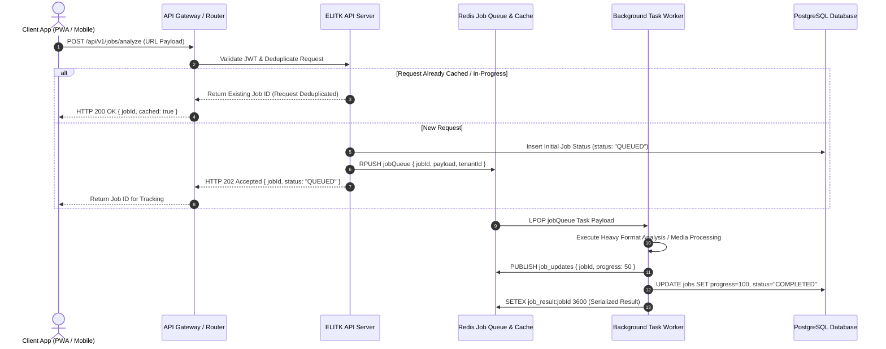
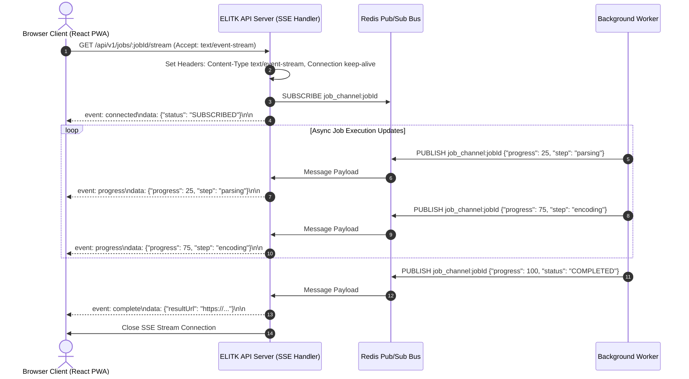
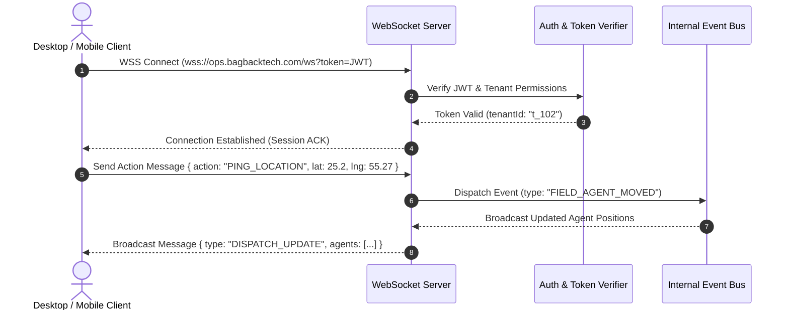

# 🔄 Data Flow and Sequence Diagrams

Inter-service communication sequences are designed around asynchronous job execution, real-time Server-Sent Events (SSE) streaming, and high-performance WebSocket event buses.

---

## 1. Asynchronous Job Execution Sequence

---

## 2. Real-Time Server-Sent Events (SSE) Streaming Sequence

---

## 3. WebSocket Event Bus Communication

---

## 🔑 Key Engineering Patterns

- **Connection Cleanup**: SSE and WebSocket handlers implement strict heartbeat timeouts and client disconnect listeners to prevent socket memory leaks.
- **Request Deduplication**: In-flight HTTP POST analyze requests are keyed in Redis by SHA-256 payload hashes (`dedup:sha256`), preventing redundant worker processing in the cluster.
