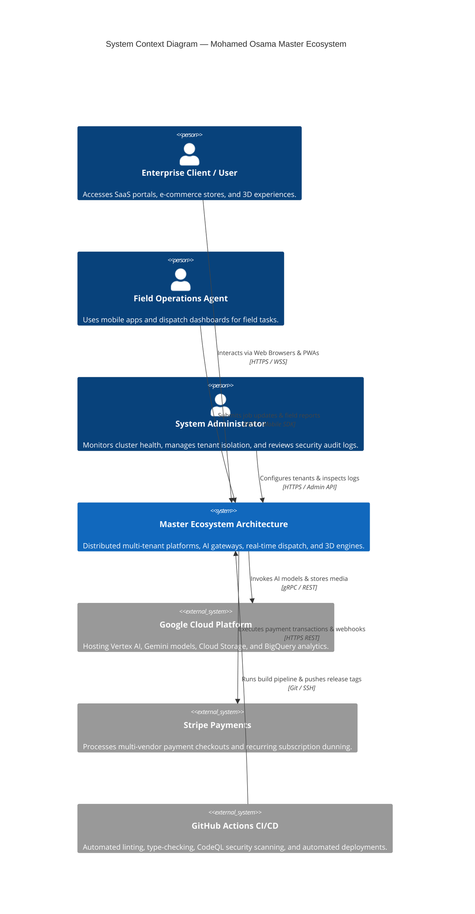
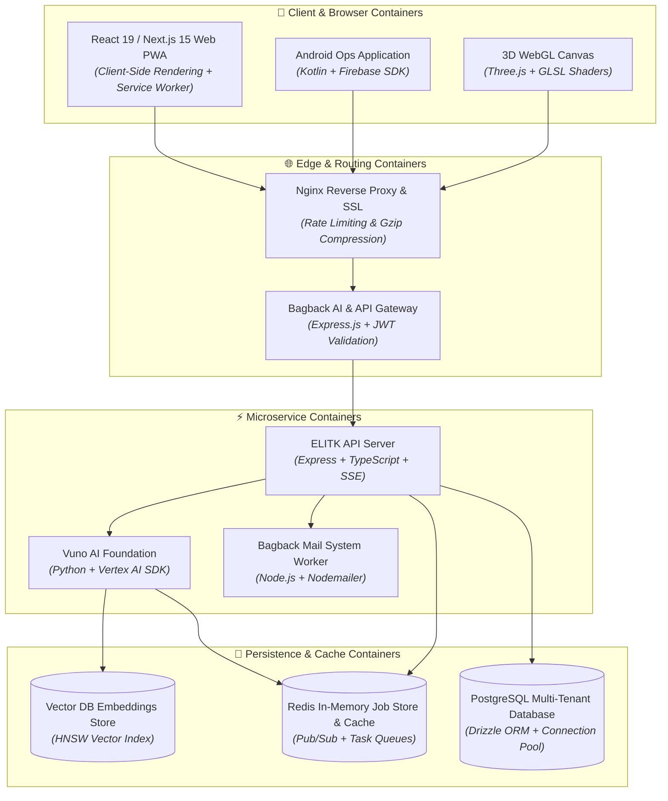

# 📐 System Architecture (C4 Model)

This document presents the **C4 Model** (Context & Container Levels) for Mohamed Osama's master software ecosystem.

---

## 1. C4 Context Level Diagram

The Context diagram illustrates how human personas interact with the overall ecosystem edge and backend infrastructure.

---

## 2. C4 Container Level Diagram

The Container diagram decomposes the ecosystem into runtime containers: Web PWAs, API Gateways, Microservices, Async Job Stores, Caches, and Databases.

---

## 3. Container Responsibilities Breakdown

| Container | Tech Stack | Primary Responsibilities |
| :--- | :--- | :--- |
| **Web PWA** | Next.js 15, React 19, TailwindCSS | SSR/ISR page rendering, offline asset caching via Service Worker, UI state management. |
| **Nginx Reverse Proxy** | Nginx, Certbot SSL | TLS termination, DDoS rate-limiting, static file serving, and upstream load balancing. |
| **API Gateway** | Express.js, TypeScript | Request deduplication, JWT authentication header verification, API rate-limit enforcement. |
| **API Server** | Express.js, Node.js, SSE | Core business logic, SSE streaming endpoint, database transaction management. |
| **In-Memory Job Store** | Redis 7.2 | Async task queue, job status pub/sub, real-time session caching. |
| **PostgreSQL Database** | PostgreSQL 16, Drizzle ORM | Persistent relational data, multi-tenant row-level isolation policies. |
| **Vector DB Store** | pgvector / HNSW | High-dimensional embedding storage for semantic AI document search. |
