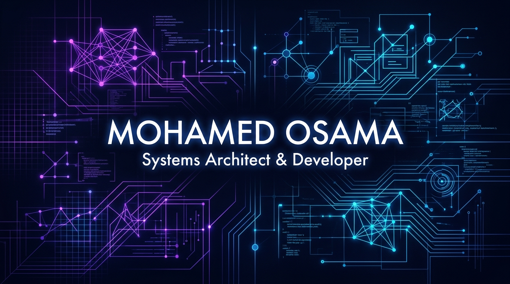
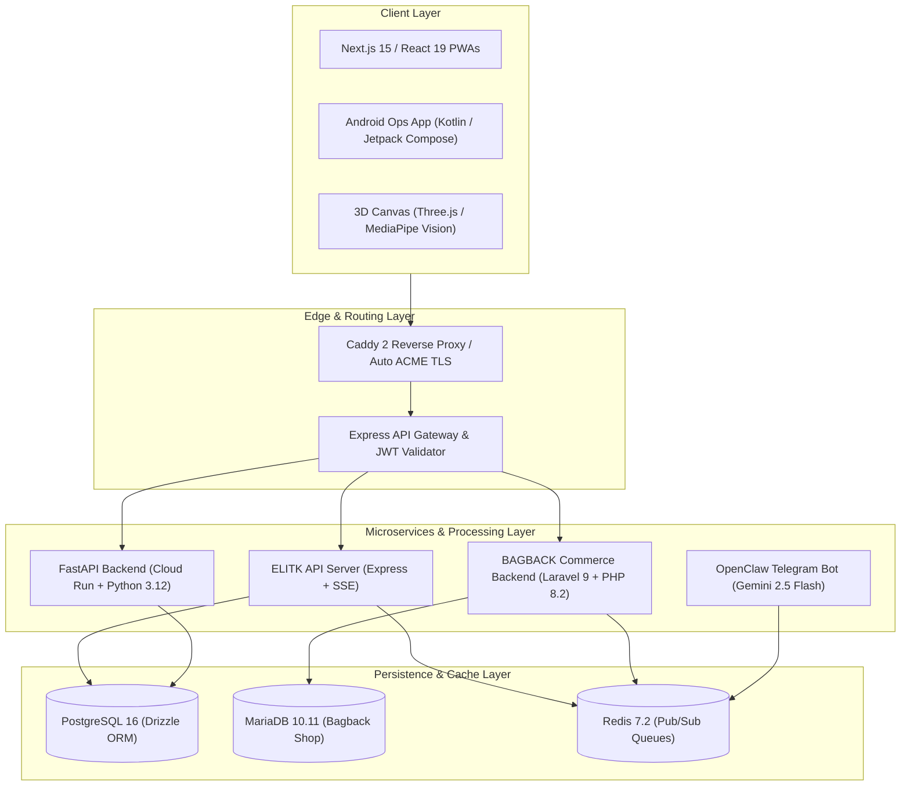

<div align="center">
  <!-- Custom premium visual banner -->
  <a href="https://mohamedosama.me"></a>
  
  <br><br>
  
  <!-- Typing animation matching the cyber-violet design theme -->
  <a href="https://git.io/typing-svg"></a>

  <br>

  <!-- Subtitle / Focus areas -->
  <p align="center">
    <b>AI Infrastructure • Multi-Tenant SaaS Engines • Real-Time Systems • 3D WebGL</b>
  </p>

  <!-- Badge Hub -->
  <p align="center">
    <a href="https://github.com/users/mohamedosamaai/projects/12">
      
    </a>
    <a href="https://github.com/mohamedosamaai/mohamedosamaai/actions">
      
    </a>
    <a href="https://github.com/mohamedosamaai/mohamedosamaai/actions">
      
    </a>
  </p>

  <hr width="50%">
</div>

---

<div align="center">
  <h3>📊 Architectural Metrics & Infrastructure Overview</h3>
  
  <table align="center" style="border: none; border-collapse: collapse; width: 100%;">
    <tr style="border: none;">
      <td style="border: none; padding: 10px; text-align: center; width: 25%;">
        <b>Production Ecosystem</b><br>
        ⚡ 15 Audited Repositories
      </td>
      <td style="border: none; padding: 10px; text-align: center; width: 25%;">
        <b>Multi-Tenant Isolation</b><br>
        🔒 Schema & Row-Level Security
      </td>
      <td style="border: none; padding: 10px; text-align: center; width: 25%;">
        <b>3D & Computer Vision</b><br>
        👁️ Three.js & MediaPipe AI
      </td>
      <td style="border: none; padding: 10px; text-align: center; width: 25%;">
        <b>Concurrency & Queue</b><br>
        🚀 Redis Pub/Sub & SSE Streams
      </td>
    </tr>
  </table>
</div>

---

## 🏛️ Executive Engineering Overview

I am Mohamed Osama, Founder & Lead Systems Architect at **Bagback Digital Solutions**. This repository serves as the central architectural hub and technical blueprint for production platforms, microservice engines, and digital transformation solutions engineered across my software practice.

I design scalable, resilient software infrastructures — bridging client-side 3D WebGL rendering and real-time computer vision with robust multi-tenant backends, event-driven web sockets, and zero-downtime microservices.

---

## 📊 GitHub Analytics & Repository Metrics

<table align="center" width="100%" style="border-collapse: collapse; border: none;">
  <tr style="border: none;">
    <td width="50%" align="center" style="border: none; padding: 10px;">
      
    </td>
    <td width="50%" align="center" style="border: none; padding: 10px;">
      
    </td>
  </tr>
  <tr style="border: none;">
    <td colspan="2" align="center" style="border: none; padding: 10px;">
      
    </td>
  </tr>
</table>

---

## 🛠️ Tech Stack & Systems Toolbox

<table align="center" width="100%" style="border-collapse: collapse; border: none;">
  <tr style="border: none;">
    <td style="border: none; padding: 10px; vertical-align: top;" width="33%">
      <h4>🧠 AI & Backend Engines</h4>
      
      
      
      
      
      
    </td>
    <td style="border: none; padding: 10px; vertical-align: top;" width="33%">
      <h4>🎨 Frontend & 3D WebGL</h4>
      
      
      
      
      
    </td>
    <td style="border: none; padding: 10px; vertical-align: top;" width="33%">
      <h4>☁️ Infrastructure & Database</h4>
      
      
      
      
      
      
    </td>
  </tr>
</table>

---

## 📐 C4 System Architecture Diagram

The diagram below illustrates the high-level boundary between client interfaces, edge proxies, microservice runtimes, and persistence layers across the ecosystem:



---

## 📂 Core Specialization Layers

<details>
  <summary>🤖 <b>1. AI Infrastructure & Security Layer</b> (Click to Expand)</summary>
  <br>
  
  | Platform / Repository | Tech Stack | Architectural Function & Scope | Status |
  | :--- | :--- | :--- | :---: |
  | **VOUNO** *(Client Project)* | React 19, Next.js 16, TypeScript 5.8, `@google/genai` Gemini API, Firebase 11, TailwindCSS 4, jsPDF | Enterprise trade finance & guarantee solutions platform. Automated structuring, server-side AI trade contract advisory, zero cash margin structuring, fee calculators, and PDF quote exports. | `LIVE PRODUCTION` |
  | **Elitk Library** | FastAPI (Python 3.12, Cloud Run), React (Firebase Hosting), Cloud SQL PostgreSQL, Google Secret Manager | Developer AI workspace hosting 2,771 curated prompt cards, MCP server profiles, developer skills, AI Workbench, and scale-to-zero GCP backend. | `LIVE PRODUCTION` |
  | **OpenClaw & WriteClaw** | Python 3.12, Gemini 2.5 Flash, `python-telegram-bot`, APScheduler, Docker, OVH VPS | AI Telegram command center (`@Bagback_bot`) and automated article generation factory with persistent memory and knowledge base ingestion. | `LIVE PRODUCTION` |

</details>

<details>
  <summary>👁️ <b>2. Computer Vision Pipelines & AI Layer</b> (Click to Expand)</summary>
  <br>
  
  | Platform / Repository | Tech Stack | Architectural Function & Scope | Status |
  | :--- | :--- | :--- | :---: |
  | **Elitk** | Express 5, React 18, Vite 7, TypeScript 5.6, PostgreSQL 16, Drizzle ORM, Socket.io 4, Vertex AI | Multi-tenant AI business operating system for social media, ads, CRM, outreach, and growth analytics with schema-level tenant data isolation. | `LIVE PRODUCTION` |
  | **BagbackTech Agency** | Next.js 15.5, Genkit AI (`@genkit-ai/google-genai`), Dialogflow CX, Firebase Admin, TailwindCSS, Framer Motion | Flagship digital agency platform and AI client interaction engine. Features context-aware prompt grounding, dynamic SSR rendering, and bilingual acquisition. | `LIVE PRODUCTION` |
  | **Bagback Webmail** | Next.js 16, React 19, IMAPFlow, Mailparser, Nodemailer, Firebase Admin, TailwindCSS 4 | AI-powered unified webmail client and workspace hub. Async IMAP stream parsing, attachment processing, and transactional mail dispatch. | `LIVE PRODUCTION` |

</details>

<details>
  <summary>🌐 <b>3. 3D WebGL Web Apps Layer</b> (Click to Expand)</summary>
  <br>
  
  | Platform / Repository | Tech Stack | Architectural Function & Scope | Status |
  | :--- | :--- | :--- | :---: |
  | **Resonance 8 Studio** | Three.js, React Three Fiber (`@react-three/fiber`, `@react-three/drei`), MediaPipe Vision (`@mediapipe/tasks-vision`), React 19, Vite 8 | Interactive 3D graphics studio and real-time camera face mesh tracking engine. 60 FPS GPU facial landmark mapping and custom shaders. | `LIVE PRODUCTION` |
  | **El Zayd Domain Sales** | HTML5, Modern CSS3, Vanilla JS, Schema.org JSON-LD, Cloudflare Pages, Dan.com | Premium domain sales landing page (`elzayd.com`). Features bilingual RTL/LTR layout, structured product schema, and instant buy integration. | `LIVE PRODUCTION` |
  | **Mohamed Portfolio** | Next.js 16, React 19, TypeScript 5, Better-SQLite3, Next-MDX-Remote, TailwindCSS 4 | Personal developer portfolio (`mohamedosama.me`) and admin CMS dashboard with SQLite storage and Caddy 2 reverse proxy deployment. | `LIVE PRODUCTION` |

</details>

<details>
  <summary>⚡ <b>4. Real-Time Systems & Queues Layer</b> (Click to Expand)</summary>
  <br>
  
  | Platform / Repository | Tech Stack | Architectural Function & Scope | Status |
  | :--- | :--- | :--- | :---: |
  | **Elitk Ops / Control Tower** | Next.js 15, React 19, Firebase, Google Maps, Serwist PWA, Zustand, Kotlin Android (`laforma-ops-app`) | Real-time field operations OS and ground agent dispatch hub (`ops.bagbacktech.com`). Features live GPS tracking, task assignment, and offline PWA sync. | `LIVE PRODUCTION` |
  | **Bagback Shop** | Laravel 9 (PHP 8.2), Vue 3, Bootstrap 5, MariaDB, Redis, Stripe, MyFatoorah, Twilio | Multi-vendor commerce platform (`bagback.shop`). Features multi-merchant storefronts, async webhook payment queues, and SMS notifications. | `LIVE PRODUCTION` |
  | **La Forma Contracting** *(Client Project)* | Next.js 14, React 18, TypeScript 5.9, TailwindCSS 3.4, Framer Motion, Firebase Admin, Radix UI | Corporate contracting platform (`laforma.ae`) and UAE technical services showcase with responsive layout and modern UI tokens. | `LIVE PRODUCTION` |
  | **Bagback Download** | Vite, React 19, TypeScript 5.5, Express, yt-dlp stream extraction, Redis | Unified stream and media format extraction monorepo engine. Handles async format analysis and media downloading. | `LIVE PRODUCTION` |

</details>

---

## 🏛️ Ecosystem Architectural Matrix (15 Audited Repositories)

<details>
  <summary>🔍 <b>View Architectural Repository Matrix</b> (Click to Expand)</summary>
  <br>
  
  | # | Repository Name | Core Tech Stack | Architectural Function & Scope |
  | :-: | :--- | :--- | :--- |
  | **1** | `bagbacktech.com` | Next.js 15.5, Genkit AI, Dialogflow CX | Flagship agency Web PWA & AI client interaction engine. |
  | **2** | `elitk` | Express 5, React 18, Vite 7, PostgreSQL 16, Drizzle | Multi-tenant AI operating system & business management platform. |
  | **3** | `library.elitk.com` | FastAPI (Python 3.12), Cloud Run, React | 2,771 curated AI prompts, MCP server profiles & developer workbench. |
  | **4** | `ops` / `laforma-ops-app` | Next.js 15, React 19, Firebase, Kotlin Android | Operations control tower & real-time field agent dispatch engine. |
  | **5** | `BAGBACK` | Laravel 9 (PHP 8.2), Vue 3, MariaDB, Redis | Multi-vendor commerce platform with Stripe & MyFatoorah payment queues. |
  | **6** | `Laforma` | Next.js 14, React 18, TailwindCSS, Firebase Admin | Enterprise contracting platform & UAE technical services portal. |
  | **7** | `BAGBACK_BOT` | Python 3.12, Gemini 2.5 Flash, Telegram Bot API | AI Telegram command center (`@Bagback_bot`) & article generation bot. |
  | **8** | `bagback-download` | Vite, React 19, TypeScript 5.5, Express, yt-dlp | Unified stream & media format extraction monorepo. |
  | **9** | `VOUNO` | React 19, Vite 6, Express, Google GenAI, jsPDF | Multi-tenant AI ERP dashboard & PDF report generator. |
  | **10** | `elitk-8` | Three.js, React Three Fiber, MediaPipe Vision | Interactive 3D WebGL experience & real-time camera face mesh tracking. |
  | **11** | `elzayd-landing` | HTML5, Modern CSS3, Cloudflare Pages | Premium domain sales landing page & conversion funnel. |
  | **12** | `mohamed` | Next.js 16, React 19, Better-SQLite3 | Personal developer portfolio (`mohamedosama.me`) with admin CMS. |
  | **13** | `webmail` / `bagback-hub` | Next.js 16, React 19, IMAPFlow, Mailparser | Multi-tenant webmail client & async email processing hub. |
  | **14** | `bagback-server` | OVH VPS Extreme, Caddy 2, Docker, WireGuard | Production server infrastructure (`bagback-codex`) hosting all domains. |
  | **15** | `mohamedosamaai` | TypeScript 5.5, GitHub Actions CI/CD | Master ecosystem architecture hub & CI/CD quality gate. |

</details>

---

## 📚 Ecosystem Documentation & Wiki

Explore detailed architectural specifications hosted on the official GitHub Wiki:

- [Architectural Philosophy & Governance](https://github.com/mohamedosamaai/mohamedosamaai/wiki/Home)
- [C4 System Architecture Diagrams](https://github.com/mohamedosamaai/mohamedosamaai/wiki/System-Architecture)
- [Async Job Sequences & SSE Data Flows](https://github.com/mohamedosamaai/mohamedosamaai/wiki/Data-Flow-and-Sequence)
- [Multi-Tenant Isolation & Security Strategy](https://github.com/mohamedosamaai/mohamedosamaai/wiki/Security-and-Multi-Tenancy)
- [OpenAPI Specifications & Endpoint Index](https://github.com/mohamedosamaai/mohamedosamaai/wiki/API-and-Integrations)
- [Developer Setup & Environment Playbook](https://github.com/mohamedosamaai/mohamedosamaai/wiki/Developer-Setup)

---

## 🛠️ Verification & Build Commands

```bash
# Verify TypeScript strict compilation across exports
npm run type-check

# Execute local showcase generator script
powershell -ExecutionPolicy Bypass -File ./tools/showcase-generator.ps1
```

---

<div align="center">
  <h3>📬 Let's Connect & Architect Together</h3>
  
  <a href="https://mohamedosama.me">
    
  </a>
  <a href="https://linkedin.com/in/mohamedosamaai">
    
  </a>
  <a href="https://twitter.com/mohamedosamaai">
    
  </a>
  <a href="mailto:mohamed@bagbacktech.com">
    
  </a>
</div>
