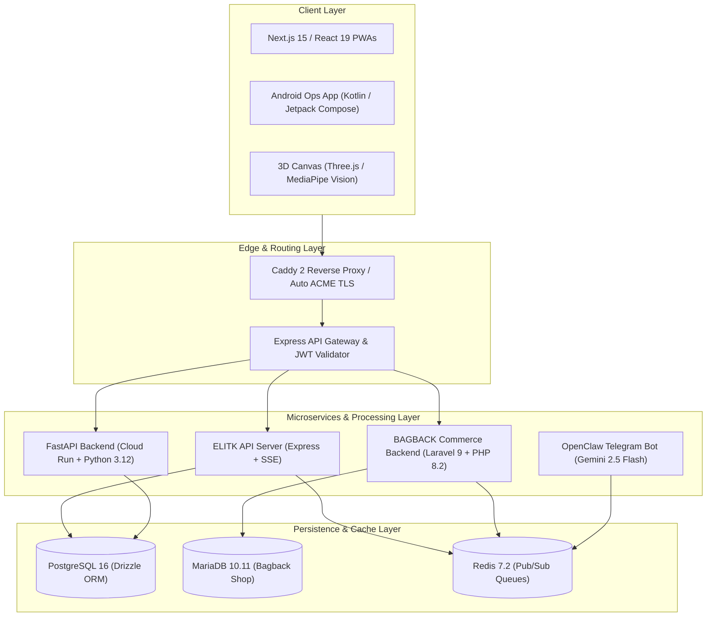

<div align="center">
  <!-- Typing animation matching the cyber-violet design theme -->
  <a href="https://github.com/mohamedosamaai"></a>

  <br>

  <!-- Subtitle / Focus areas -->
  <p align="center">
    <b>AI Infrastructure • Multi-Tenant SaaS Engines • Real-Time Systems • 3D WebGL</b>
  </p>

  <!-- Badge Hub -->
  <p align="center">
    <a href="https://github.com/users/mohamedosamaai/projects/12">
      
    </a>
    <a href="https://github.com/mohamedosamaai/mohamedosamaai/actions">
      
    </a>
    <a href="https://github.com/mohamedosamaai/mohamedosamaai/actions">
      
    </a>
    <a href="https://github.com/mohamedosamaai/mohamedosamaai/pkgs/npm/ecosystem-master">
      
    </a>
  </p>

  <hr width="50%">
</div>

---

<div align="center">
  <h3>Architectural Metrics & Infrastructure Overview</h3>
  
  <table align="center" style="border: none; border-collapse: collapse; width: 100%;">
    <tr style="border: none;">
      <td style="border: none; padding: 10px; text-align: center; width: 25%;">
        <b>Production Ecosystem</b><br>
        ⚡ 15 Audited Repositories
      </td>
      <td style="border: none; padding: 10px; text-align: center; width: 25%;">
        <b>Multi-Tenant Isolation</b><br>
        🔒 Schema & Row-Level Security
      </td>
      <td style="border: none; padding: 10px; text-align: center; width: 25%;">
        <b>3D & Computer Vision</b><br>
        👁️ Three.js & MediaPipe AI
      </td>
      <td style="border: none; padding: 10px; text-align: center; width: 25%;">
        <b>Concurrency & Queue</b><br>
        🚀 Redis Pub/Sub & SSE Streams
      </td>
    </tr>
  </table>
</div>

---

## Executive Engineering Overview

I am Mohamed Osama, Founder & Lead Systems Architect at **Bagback Digital Solutions**. This repository serves as the central architectural hub and technical blueprint for production platforms, microservice engines, and digital transformation solutions engineered across my software practice.

I design scalable, resilient software infrastructures — bridging client-side 3D WebGL rendering and real-time computer vision with robust multi-tenant backends, event-driven web sockets, and zero-downtime microservices.

---

## Tech Stack & Systems Toolbox

<table align="center" width="100%" style="border-collapse: collapse; border: none;">
  <tr style="border: none;">
    <td style="border: none; padding: 10px; vertical-align: top;" width="33%">
      <h4>AI & Backend Engines</h4>
      <p>
         Python<br>
         FastAPI<br>
         Node.js<br>
         Express<br>
         Laravel<br>
         TypeScript
      </p>
    </td>
    <td style="border: none; padding: 10px; vertical-align: top;" width="33%">
      <h4>Frontend & 3D WebGL</h4>
      <p>
         React<br>
         Next.js<br>
         Three.js<br>
         Tailwind CSS<br>
         Kotlin
      </p>
    </td>
    <td style="border: none; padding: 10px; vertical-align: top;" width="33%">
      <h4>Infrastructure & Database</h4>
      <p>
         PostgreSQL<br>
         Redis<br>
         Docker<br>
         GCP<br>
         Caddy<br>
         GitHub Actions
      </p>
    </td>
  </tr>
</table>

---

## C4 System Architecture Diagram

The diagram below illustrates the high-level boundary between client interfaces, edge proxies, microservice runtimes, and persistence layers across the ecosystem:



---

## Core Specialization Layers

<details>
  <summary><b>AI Infrastructure & Security Layer</b> (Click to Expand)</summary>
  <br>
  
  | Platform / Repository | Tech Stack | Architectural Function & Scope | Status |
  | :--- | :--- | :--- | :---: |
  | **[VOUNO Platform](https://vouno.ae/)** | React 19, Next.js 16, TypeScript 5.8, `@google/genai` Gemini API, Firebase 11, TailwindCSS 4, jsPDF | UAE Trade Finance & Fintech SaaS platform. Features automated trade contract advisory, zero cash margin structuring, fee calculators, and PDF quote exports. *(Client Implementation)* | `LIVE PRODUCTION` |
  | **[AI Workspace](https://ai.bagbacktech.com)** | FastAPI (Python 3.12, Cloud Run), React, Cloud SQL PostgreSQL, Google Secret Manager | Internal developer AI workspace hosting 2,771 curated prompt cards, MCP server profiles, developer tools, AI Workbench, and scale-to-zero GCP backend. | `LIVE PRODUCTION` |
  | **[BAGBACK_BOT](https://t.me/Bagback_bot)** | Python 3.12, Gemini 2.5 Flash, `python-telegram-bot`, APScheduler, Docker, OVH VPS | Central AI Telegram command center (`@Bagback_bot`) and automated article generation engine with persistent memory and knowledge base ingestion. | `LIVE PRODUCTION` |

</details>

<details>
  <summary><b>Computer Vision Pipelines & AI Layer</b> (Click to Expand)</summary>
  <br>
  
  | Platform / Repository | Tech Stack | Architectural Function & Scope | Status |
  | :--- | :--- | :--- | :---: |
  | **[Elitk](https://elitk.com)** | Express 5, React 18, Vite 7, TypeScript 5.6, PostgreSQL 16, Drizzle ORM, Socket.io 4, Vertex AI | Standalone AI Marketing & Automation Platform. Multi-tenant system for social media, campaigns, CRM, outreach, and growth analytics with schema-level tenant data isolation. | `LIVE PRODUCTION` |
  | **[BagbackTech](https://bagbacktech.com)** | Next.js 15.5, Genkit AI (`@genkit-ai/google-genai`), Dialogflow CX, Firebase Admin, TailwindCSS, Framer Motion | Flagship AI Product Studio & Startup Enablement Platform. Features multi-agent orchestration, context-aware prompt grounding, dynamic SSR rendering, and bilingual acquisition. | `LIVE PRODUCTION` |
  | **[Mail](https://mail.bagbacktech.com)** | Next.js 16, React 19, IMAPFlow, Mailparser, Nodemailer, Firebase Admin, TailwindCSS 4 | Unified AI-powered business inbox client and workspace hub. Async IMAP stream parsing, attachment processing, Gemini summaries, and transactional mail dispatch. | `LIVE PRODUCTION` |

</details>

<details>
  <summary><b>3D WebGL Web Apps Layer</b> (Click to Expand)</summary>
  <br>
  
  | Platform / Repository | Tech Stack | Architectural Function & Scope | Status |
  | :--- | :--- | :--- | :---: |
  | **[Google I/O 2026](https://8.elitk.com/)** | Three.js, React Three Fiber (`@react-three/fiber`, `@react-three/drei`), MediaPipe Vision (`@mediapipe/tasks-vision`), React 19, Vite 8 | Interactive 3D graphics studio and real-time camera face mesh tracking engine. 60 FPS GPU facial landmark mapping and custom shaders. *(Independent Isolated Build)* | `LIVE PRODUCTION` |
  | **[elzayd-landing](https://elzayd.com)** | HTML5, Modern CSS3, Vanilla JS, Schema.org JSON-LD, Cloudflare Pages, Dan.com | Premium domain sales landing page (`elzayd.com`). Features bilingual RTL/LTR layout, structured product schema, and instant buy integration. | `LIVE PRODUCTION` |
  | **[Portfolio](https://mohamedosama.me)** | Next.js 16, React 19, TypeScript 5, Better-SQLite3, Next-MDX-Remote, TailwindCSS 4 | Personal developer portfolio (`mohamedosama.me`) and ecosystem index with SQLite administrative CMS dashboard and Caddy 2 reverse proxy deployment. | `LIVE PRODUCTION` |

</details>

<details>
  <summary><b>Real-Time Systems & Queues Layer</b> (Click to Expand)</summary>
  <br>
  
| Platform / Repository | Tech Stack | Architectural Function & Scope | Status |
| :--- | :--- | :--- | :--- |
| **[BagbackTech](https://bagbacktech.com)** | Next.js 15, React 19, Node.js, PostgreSQL, Vertex AI, Genkit | AI Product Studio & Startup Enablement Platform. Multi-agent orchestration architecture engineered for business ideation, AI business planning, and automated product execution. | `LIVE PRODUCTION` |
| **[ELITK Operations](https://ops.bagbacktech.com)** | Next.js 15, React 19, Firebase, Google Maps, Serwist PWA, Zustand, Kotlin Android | Real-time field operations OS and ground agent dispatch hub (`ops.bagbacktech.com`). Features live GPS tracking, task assignment, and offline PWA sync. | `LIVE PRODUCTION` |
| **[ELITK](https://elitk.com)** | Next.js 15, TypeScript, Node.js, PostgreSQL, Drizzle ORM, AI Automations | Standalone AI Marketing & Automation Platform. Autonomous system handling dynamic content generation, CRM, campaign management, and advanced customer engagement workflows. | `LIVE PRODUCTION` |
| **[Bagback Webmail](https://mail.bagbacktech.com)** | Next.js 15, React 19, TypeScript, IMAP/SMTP, Gemini API | Unified AI-powered business inbox client. Consolidates multiple Gmail and IMAP accounts with Gemini-driven workflow integrations, bilingual summaries, and context-aware replies. | `LIVE PRODUCTION` |
| **[ELITK AI Library](https://ai.bagbacktech.com)** | Next.js, React, TypeScript, Vector DB, Knowledge Graph | Internal developer knowledge base and AI prompt library. Designed specifically for AI workflows, reusable components, and enhancing internal AI infrastructure productivity. | `LIVE PRODUCTION` |
| **[Bagback Download](https://download.bagbacktech.com)** | Vite, React 19, TypeScript 5.5, Express, yt-dlp stream extraction, Redis | Unified stream and media format extraction monorepo engine. Handles async format analysis and media downloading across the ecosystem. | `LIVE PRODUCTION` |
| **[VOUNO Bank Brokers](https://vouno.ae)** | Next.js, React, TailwindCSS, PostgreSQL, Google Cloud | UAE Trade Finance & Fintech SaaS platform. Built for digital transformation featuring live bank guarantee verification pipelines and automated financial reporting. | `LIVE PRODUCTION` |
| **[LaForma Client Portal](https://laforma.ae)** | Next.js 14, React 18, TypeScript 5.9, TailwindCSS 3.4, Framer Motion, Firebase Admin, Radix UI | Corporate contracting platform and UAE technical services showcase (`laforma.ae`). Features responsive static export architecture, parallel RTL/LTR layouts, and modern UI tokens. | `LIVE PRODUCTION` |
| **[Bagback Commerce](https://bagback.shop)** | Laravel 9 (PHP 8.2), Vue 3, Bootstrap 5, MariaDB, Redis, Stripe, MyFatoorah, Twilio | Multi-vendor wholesale commerce platform (`bagback.shop`). Features multi-merchant storefronts, async webhook payment queues, commission tracking, and SMS notifications. | `LIVE PRODUCTION` |
| **[Resonance 8](https://8.elitk.com/)** | Next.js, React, TypeScript, Experimental AI APIs | Independent build for a Google I/O 2026 challenge. Completely isolated from the ELITK ecosystem, designed to showcase experimental AI integration and rendering capabilities. | `LIVE PRODUCTION` |

</details>

---

## Ecosystem Architectural Matrix (15 Audited Repositories)

<details>
  <summary><b>View Architectural Repository Matrix</b> (Click to Expand)</summary>
  <br>
  
  | # | Repository Name | Core Tech Stack | Architectural Function & Scope |
  | :-: | :--- | :--- | :--- |
  | **1** | **[BagbackTech](https://bagbacktech.com)** | Next.js 15.5, Genkit AI, Dialogflow CX | Flagship AI Product Studio & Startup Enablement Platform. Driven by multi-agent orchestration for business ideation and execution. |
  | **2** | **[Elitk](https://elitk.com)** | Express 5, React 18, Vite 7, PostgreSQL 16, Drizzle | Standalone AI Marketing & Automation Platform. Engineered for dynamic content generation, CRM, and customer engagement workflows. |
  | **3** | **[AI Workspace](https://ai.bagbacktech.com)** | FastAPI (Python 3.12), Cloud Run, React | Internal developer knowledge base and AI prompt library designed for AI workflows, reusable components, and enhancing internal AI infrastructure. |
  | **4** | **[(Ops)](https://ops.bagbacktech.com)** / `laforma-ops-app` | Next.js 15, React 19, Firebase, Kotlin Android | Enterprise Business Operations Platform. Manages workflow automation, real-time field operations, and ground agent dispatch tracking. |
  | **5** | **[Bagback Commerce](https://bagback.shop)** | Laravel 9 (PHP 8.2), Vue 3, MariaDB, Redis | Wholesale Commerce Engine. Multi-vendor platform featuring scalable async webhook payment queues and commission tracking. *(Portfolio Project)* |
  | **6** | **[Laforma Platform](https://laforma.ae)** | Next.js 14, React 18, TailwindCSS, Firebase Admin | Bilingual Lead-Generation Platform. Features responsive static export architecture and parallel RTL/LTR layouts. *(Client Implementation)* |
  | **7** | **[BAGBACK_BOT](https://t.me/Bagback_bot)** | Python 3.12, Gemini 2.5 Flash, Telegram API | Central AI Telegram command center (`@Bagback_bot`) and automated contextual article generation engine. |
  | **8** | **[Download](https://download.bagbacktech.com)** / `bagback-download` | Vite, React 19, TypeScript 5.5, Express, yt-dlp | Unified stream and media format extraction monorepo engine. Handles async format analysis and media downloading across the ecosystem. |
  | **9** | **[VOUNO Platform](https://vouno.ae/)** | React 19, Vite 6, Express, Google GenAI, jsPDF | UAE Trade Finance & Fintech SaaS. Secure digital transformation project featuring live bank guarantee verification pipelines and automated reporting. *(Client Implementation)* |
  | **10** | **[Google I/O 2026](https://8.elitk.com/)** | Three.js, React Three Fiber, MediaPipe Vision | Independent build for a Google I/O 2026 challenge. Features interactive 3D WebGL and real-time camera face mesh tracking. *(Isolated from ELITK)* |
  | **11** | **[elzayd-landing](https://elzayd.com)** | HTML5, Modern CSS3, Cloudflare Pages | Premium domain sales landing page featuring a bilingual layout and an optimized conversion funnel architecture. |
  | **12** | **[Portfolio](https://mohamedosama.me)** / `mohamed` | Next.js 16, React 19, Better-SQLite3 | Personal developer portfolio and centralized ecosystem index integrated with a fast SQLite administrative CMS dashboard. |
  | **13** | **[Mail](https://mail.bagbacktech.com)** / `bagback-hub` | Next.js 16, React 19, IMAPFlow, Mailparser | Unified AI-powered business inbox client and async email processing hub consolidating multiple IMAP/SMTP accounts. |
  | **14** | `bagback-server` | OVH VPS Extreme, Caddy 2, Docker, WireGuard | Core production server infrastructure (`bagback-codex`) and reverse proxy routing architecture hosting the complete ecosystem. |
  | **15** | `mohamedosamaai` | TypeScript 5.5, GitHub Actions CI/CD | Master ecosystem architecture hub functioning as the central index and automated CI/CD quality gate for all repositories. |

</details>

---

## Ecosystem Documentation & Wiki

Explore detailed architectural specifications hosted on the official GitHub Wiki:

- [Architectural Philosophy & Governance](https://github.com/mohamedosamaai/mohamedosamaai/wiki/Home)
- [C4 System Architecture Diagrams](https://github.com/mohamedosamaai/mohamedosamaai/wiki/System-Architecture)
- [Async Job Sequences & SSE Data Flows](https://github.com/mohamedosamaai/mohamedosamaai/wiki/Data-Flow-and-Sequence)
- [Multi-Tenant Isolation & Security Strategy](https://github.com/mohamedosamaai/mohamedosamaai/wiki/Security-and-Multi-Tenancy)
- [OpenAPI Specifications & Endpoint Index](https://github.com/mohamedosamaai/mohamedosamaai/wiki/API-and-Integrations)
- [Developer Setup & Environment Playbook](https://github.com/mohamedosamaai/mohamedosamaai/wiki/Developer-Setup)

---

## Verification & Build Commands

```bash
# Verify TypeScript strict compilation across exports
npm run check-types

# Build TypeScript contracts and declarations
npm run build
```

---

<div align="center">
  <h3>Let's Connect</h3>
  
  <p align="center">
    <a href="https://mohamedosama.me">
      
    </a>
    &nbsp;
    <a href="https://linkedin.com/in/mohamedosamaai">
      
    </a>
    &nbsp;
    <a href="https://x.com/mohamedosamaai">
      
    </a>
    &nbsp;
    <a href="mailto:im@mohamedosama.me">
      
    </a>
  </p>
</div>
