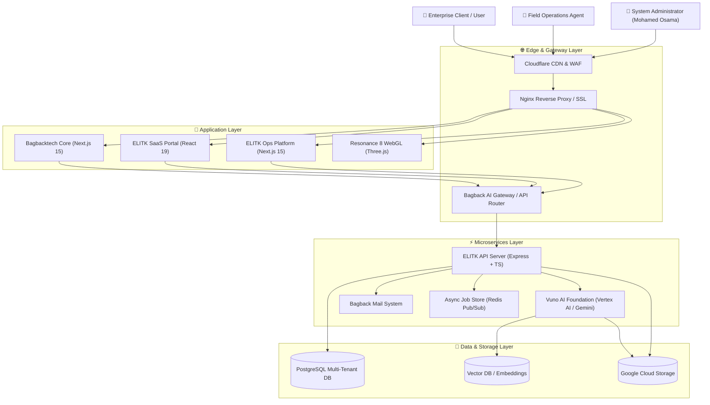

<div align="center">

# 🏛️ My Master Ecosystem Architecture Hub & System Blueprint
### AI Infrastructure, Multi-Tenant SaaS Platforms & Distributed Microservices Organization

**Mohamed Osama** — Founder, Digital Transformation Architect & Lead AI Engineer @ [Bagback Digital Solutions](https://bagbacktech.com/ar)

[](https://github.com/mohamedosamaai/mohamedosamaai/actions)
[](https://github.com/mohamedosamaai/mohamedosamaai/security/code-scanning)
[](https://www.typescriptlang.org)
[](https://react.dev)
[](https://nextjs.org)
[](https://www.postgresql.org)
[](https://orm.drizzle.team)
[](https://www.docker.com)
[](https://ai.google.dev)

---

</div>

## 👤 Executive Overview

I am Mohamed Osama, Founder & Lead AI Infrastructure Architect at Bagback Digital Solutions. This repository serves as the central hub and blueprint for my 17 production platforms, developer infrastructure tools, and client enterprise solutions.

I design and build resilient distributed systems that seamlessly scale from high-concurrency 3D WebGL experiences to zero-downtime microservices, multi-tenant SaaS engines, and autonomous AI agent workflows.

---

## 🚀 Live Interactive Demos & My Platforms

| Platform / Product | Live Production URL | Core Capabilities & My Architecture |
| :--- | :--- | :--- |
| **Bagback Digital Solutions** | [bagbacktech.com/ar](https://bagbacktech.com/ar) | My corporate agency engine, digital transformation portal & i18n showcase |
| **ELITK Enterprise SaaS** | [elitk.com](https://elitk.com) | My multi-tenant workspace, AI document parsing & tenant management platform |
| **ELITK Operations Engine** | [ops.bagbacktech.com](https://ops.bagbacktech.com) | My field operations dispatch, real-time tracking & automated work order queue |
| **Resonance 8 WebGL Hub** | [8.elitk.com](https://8.elitk.com) | My 3D WebGL interactive visualization engine & GPGPU shader suite |
| **LaForma Enterprise Real Estate** | [laforma.ae](https://laforma.ae) | My real estate broker operations platform, property catalog & lead sync engine |
| **Bagback Commerce Hub** | [bagback.shop](https://bagback.shop) | My multi-vendor e-commerce marketplace & automated payment checkout system |

---

## 🏛️ My 3-Tier Ecosystem Architecture

I structure my software services and repositories across a 3-Tier Enterprise Architecture:

| Architecture Layer | Layer Focus | Microservices & Platforms Included |
| :--- | :--- | :--- |
| **Tier 3: Enterprise & Client Solutions** | End-user products & commerce systems | `bagback-commerce-core`, `laforma-client-web`, `laforma-ops-app`, `vouno-broker-platform`, `bagback-marketing-engine` |
| **Tier 2: Developer Infrastructure Layer** | Field dispatch, mail, prompt DB & CI/CD | `elitk-ops-platform`, `ai-prompts-library`, `bagback-mail-system`, `bagback-ai-gateway`, `bagback-infra-docker`, `bagback-ci-actions` |
| **Tier 1: Core Platforms Layer** | SaaS engines, API gateways, DB & WebGL | `bagbacktech-core`, `elitk-saas-web`, `elitk-api-server`, `elitk-db-schema`, `vuno-ai-foundation`, `resonance-8-webgl` |

---

### My Complete 17-Repository Architecture Matrix

| Layer / Tier | Repository Name | Primary Tech Stack | My Architectural Responsibility |
| :--- | :--- | :--- | :--- |
| **Tier 1: Core** | `bagbacktech-core` | Next.js 15, TypeScript, TailwindCSS | My flagship corporate Web engine, SSG/ISR caching & i18n locale routing |
| **Tier 1: Core** | `elitk-saas-web` | React 19, Vite, TailwindCSS, Zustand | My multi-tenant customer dashboard, UI workspace & real-time analytics |
| **Tier 1: Core** | `elitk-api-server` | Express.js, TypeScript, SSE, WebSockets | My central API Gateway, async job dispatch, rate limiting & request deduplication |
| **Tier 1: Core** | `elitk-db-schema` | Drizzle ORM, PostgreSQL, Redis | My multi-tenant schema migrations, index optimization & caching strategy |
| **Tier 1: Core** | `vuno-ai-foundation` | Python, Vertex AI, Gemini 1.5, Vector DB | My AI foundation engine, RAG retrieval pipelines & prompt context chains |
| **Tier 1: Core** | `resonance-8-webgl` | Three.js, WebGL2, GLSL Shaders, React | My 3D graphics rendering engine, particle systems & GPGPU visualizer |
| **Tier 2: Infra** | `elitk-ops-platform` | Next.js 15, Firebase Admin, Cloud Tasks | My operational dispatch system, task queues & telemetry tracking engine |
| **Tier 2: Infra** | `ai-prompts-library` | TypeScript, Pydantic, JSON Schema | My versioned prompt repository, system instruction registry & guardrails |
| **Tier 2: Infra** | `bagback-mail-system` | Next.js 15, Nodemailer, SMTP Worker | My enterprise webmail client, transactional email queues & template renderer |
| **Tier 2: Infra** | `bagback-ai-gateway` | Node.js, Express, Google AI Studio SDK | My LLM abstraction gateway, provider failover fallback & token counter |
| **Tier 2: Infra** | `bagback-infra-docker` | Docker, Compose, Nginx, Certbot | My containerized reverse proxy setup, SSL auto-renewal & container stack |
| **Tier 2: Infra** | `bagback-ci-actions` | GitHub Actions, Shell, CodeQL | My shared CI/CD reusable workflows, SAST security templates & release scripts |
| **Tier 3: Solutions** | `bagback-commerce-core` | Next.js 15, Stripe API, TailwindCSS | My multi-vendor commerce checkout engine, cart state & inventory sync |
| **Tier 3: Solutions** | `laforma-client-web` | React 19, Vite, TailwindCSS | My client portal for real estate developments & interactive unit catalog |
| **Tier 3: Solutions** | `laforma-ops-app` | Kotlin, Android SDK, Firebase | My mobile field application for property inspectors & sales agents |
| **Tier 3: Solutions** | `vouno-broker-platform` | Next.js 15, PostgreSQL, Drizzle ORM | My brokerage analytics, commission calculator & deal workflow engine |
| **Tier 3: Solutions** | `bagback-marketing-engine` | HTML5, Vanilla JS, CSS3 | My high-converting landing page engine, lead intake webhooks & CRM sync |

---

## 📐 C4 Model — System Context Diagram



---

## 📚 Architecture Documentation Wiki

My architectural blueprints and developer documentation are structured in the [.github/wiki](./.github/wiki) directory and published directly to my GitHub Wiki:

1. [📘 Home](.github/wiki/Home.md): My Philosophy, Monorepo Architecture & Governance.
2. [📐 System Architecture](.github/wiki/System-Architecture.md): My C4 Context and Container Level Diagrams.
3. [🔄 Data Flow & Sequence](.github/wiki/Data-Flow-and-Sequence.md): My Async Jobs, SSE Streams, and WebSocket Protocols.
4. [🔌 API & Integrations](.github/wiki/API-and-Integrations.md): My RESTful Endpoints, Request Deduplication & OpenAPI Specifications.
5. [🔒 Security & Multi-Tenancy](.github/wiki/Security-and-Multi-Tenancy.md): My Multi-Tenant Isolation Model, JWT Security & Offline Mocks.
6. [💻 Developer Setup](.github/wiki/Developer-Setup.md): My Local Environment Playbook, Variables & Execution Commands.

---

## ⚙️ Quick Start for Developers

```bash
# Clone my master ecosystem hub repository
git clone https://github.com/mohamedosamaai/mohamedosamaai.git
cd mohamedosamaai

# Install dependencies with lockfile verification
npm install

# Run strict TypeScript type check
npm run type-check

# Execute my local showcase generator tool
npm run showcase:generate
```

---

## 🛡️ My Engineering Standards

- **Strict Type Safety:** All my packages enforce TypeScript strict mode with zero implicit `any`.
- **Clean Architecture:** I decouple domain logic from UI presentation and database persistence.
- **Showcase Branch Hygiene:** I maintain clean remote branches (`main` and clean integrations only).
- **Code Ownership:** I personally review and approve all pull requests (`@mohamedosamaai`).

---

<div align="center">

**© 2026 Mohamed Osama — Founder @ Bagback Digital Solutions.** All rights reserved.

</div>
