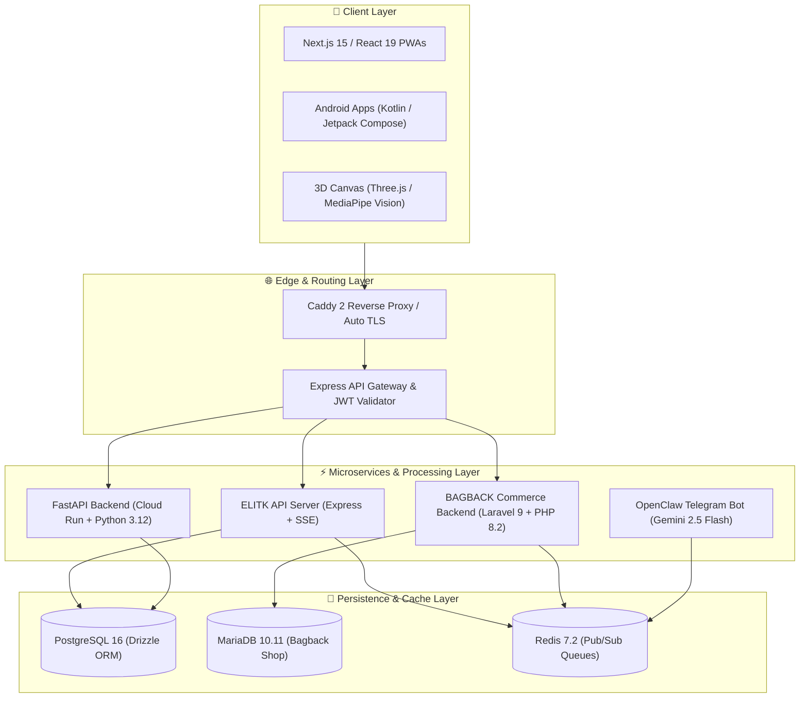

<div align="center">

# 🏛️ Mohamed Osama
### Founder & Lead Systems Architect @ [Bagback Digital Solutions](https://bagbacktech.com/ar)
**AI Infrastructure • Multi-Tenant SaaS Engines • Real-Time Systems • 3D WebGL**

```
┌─────────────────────────────────────────────────────────────────────────────┐
│  Architecting resilient microservices, high-concurrency multi-tenant SaaS,  │
│  real-time computer vision pipelines, and 3D WebGL web applications.        │
└─────────────────────────────────────────────────────────────────────────────┘
```

<p align="center">
  <a href="https://github.com/users/mohamedosamaai/projects/12">
    
  </a>
  <a href="https://github.com/mohamedosamaai/mohamedosamaai/actions">
    
  </a>
  <a href="https://github.com/mohamedosamaai/mohamedosamaai/actions">
    
  </a>
</p>

---

### ⚡ Architectural Metrics & Infrastructure Overview

| 📦 Production Ecosystem | 🛡️ Multi-Tenant Isolation | 🌐 3D & Computer Vision | ⚡ Concurrency & Queue |
| :---: | :---: | :---: | :---: |
| **16 Audited Repositories** | **Schema & Row-Level Security** | **Three.js & MediaPipe AI** | **Redis Pub/Sub & SSE Stream** |

---

</div>

## 👤 Executive Engineering Overview

I am Mohamed Osama, Founder & Lead Systems Architect at Bagback Digital Solutions. This repository serves as the central architectural hub and technical blueprint for 16 production platforms, microservice engines, and digital transformation solutions engineered across my software practice.

I design scalable, resilient software infrastructures — bridging client-side 3D WebGL rendering and real-time computer vision with robust multi-tenant backends, event-driven web sockets, and zero-downtime microservices.

---

## 🛠️ Technology Stack & Core Competencies

<div align="center">

| Domain | Production Tooling & Frameworks |
| :--- | :--- |
| **Frontend & 3D** |      |
| **Backend & AI** |       |
| **Database & Queue** |     |
| **DevOps & Cloud** |     |

</div>

---

## 🌐 Live Production Platforms & Deployed Applications

<br/>

<table>
  <tr>
    <td width="50%" valign="top">
      <h3 align="center">🌐 Bagback Digital Solutions</h3>
      <p align="center"><b>Flagship Digital Agency & AI Platform</b></p>
      <ul>
        <li><b>Tech Stack</b>: Next.js 15.5, Genkit AI, Dialogflow CX, Firebase Admin</li>
        <li><b>Capabilities</b>: Context-aware AI prompt grounding, dynamic SSR/ISR rendering, bilingual client acquisition.</li>
      </ul>
      <p align="center">
        <a href="https://bagbacktech.com/ar"><b>🔗 Visit Live Platform (bagbacktech.com/ar) »</b></a>
      </p>
    </td>
    <td width="50%" valign="top">
      <h3 align="center">🏢 ELITK Enterprise Multi-Tenant SaaS</h3>
      <p align="center"><b>Multi-Tenant AI Business Operating System</b></p>
      <ul>
        <li><b>Tech Stack</b>: Express 5, React 18, Vite 7, PostgreSQL 16, Drizzle ORM</li>
        <li><b>Capabilities</b>: Schema-level data isolation, automated subscription billing, analytical dashboards.</li>
      </ul>
      <p align="center">
        <a href="https://elitk.com"><b>🔗 Visit Live Platform (elitk.com) »</b></a>
      </p>
    </td>
  </tr>
  <tr>
    <td width="50%" valign="top">
      <h3 align="center">📚 ELITK AI Prompts Library</h3>
      <p align="center"><b>2,771 Curated AI Prompts & Developer Workbench</b></p>
      <ul>
        <li><b>Tech Stack</b>: FastAPI (Python 3.12, Cloud Run), React (Firebase Hosting), Cloud SQL</li>
        <li><b>Capabilities</b>: 2,771 prompt cards, MCP server profiles, developer skills, scale-to-zero GCP backend.</li>
      </ul>
      <p align="center">
        <a href="https://library.elitk.com"><b>🔗 Visit Live Platform (library.elitk.com) »</b></a>
      </p>
    </td>
    <td width="50%" valign="top">
      <h3 align="center">📡 Control Tower & Field Operations</h3>
      <p align="center"><b>Real-Time Field Dispatch & Operations OS</b></p>
      <ul>
        <li><b>Tech Stack</b>: Next.js 15, React 19, Firebase, Google Maps, Serwist PWA, Kotlin Android</li>
        <li><b>Capabilities</b>: Live agent GPS position tracking, automated task dispatch, offline mobile syncing.</li>
      </ul>
      <p align="center">
        <a href="https://ops.bagbacktech.com"><b>🔗 Visit Live Platform (ops.bagbacktech.com) »</b></a>
      </p>
    </td>
  </tr>
  <tr>
    <td width="50%" valign="top">
      <h3 align="center">🛒 Bagback Commerce Hub</h3>
      <p align="center"><b>Multi-Vendor E-Commerce Platform</b></p>
      <ul>
        <li><b>Tech Stack</b>: Laravel 9 (PHP 8.2), Vue 3, MariaDB, Redis, Stripe, MyFatoorah</li>
        <li><b>Capabilities</b>: Multi-vendor checkout engine, asynchronous payment queues, real-time cart state.</li>
      </ul>
      <p align="center">
        <a href="https://bagback.shop"><b>🔗 Visit Live Platform (bagback.shop) »</b></a>
      </p>
    </td>
    <td width="50%" valign="top">
      <h3 align="center">🏗️ La Forma Contracting</h3>
      <p align="center"><b>Corporate Contracting & UAE Technical Services</b></p>
      <ul>
        <li><b>Tech Stack</b>: Next.js 14, React 18, TypeScript, TailwindCSS, Firebase Admin</li>
        <li><b>Capabilities</b>: High-conversion project showcase, responsive layout, modern design tokens.</li>
      </ul>
      <p align="center">
        <a href="https://laforma.ae"><b>🔗 Visit Live Platform (laforma.ae) »</b></a>
      </p>
    </td>
  </tr>
  <tr>
    <td width="50%" valign="top">
      <h3 align="center">🤖 OpenClaw AI Telegram Bot</h3>
      <p align="center"><b>AI Telegram Command Center & Article Factory</b></p>
      <ul>
        <li><b>Tech Stack</b>: Python 3.12, Gemini 2.5 Flash, python-telegram-bot, Docker, OVH VPS</li>
        <li><b>Capabilities</b>: Daily article generator, knowledge base Q&A, automated Telegram digest.</li>
      </ul>
      <p align="center">
        <a href="https://t.me/Bagback_bot"><b>🔗 Interact with Telegram Bot (@Bagback_bot) »</b></a>
      </p>
    </td>
    <td width="50%" valign="top">
      <h3 align="center">📱 Seal Media Downloader App</h3>
      <p align="center"><b>Material You Android Downloader Application</b></p>
      <ul>
        <li><b>Tech Stack</b>: Kotlin 2.0, Jetpack Compose, Material Design 3, yt-dlp, aria2c</li>
        <li><b>Capabilities</b>: Open-source media downloader, custom command templates, audio metadata embedding.</li>
      </ul>
      <p align="center">
        <a href="https://f-droid.org/packages/com.junkfood.seal/"><b>🔗 View on F-Droid / GitHub »</b></a>
      </p>
    </td>
  </tr>
  <tr>
    <td width="50%" valign="top">
      <h3 align="center">🎨 Resonance 8 WebGL Studio</h3>
      <p align="center"><b>Interactive 3D Graphics & Vision Engine</b></p>
      <ul>
        <li><b>Tech Stack</b>: Three.js, React Three Fiber, MediaPipe Vision, React 19</li>
        <li><b>Capabilities</b>: 60 FPS GPU face mesh tracking, custom shaders, 3D interactive product rendering.</li>
      </ul>
      <p align="center">
        <a href="https://8.elitk.com"><b>🔗 Visit Live Platform (8.elitk.com) »</b></a>
      </p>
    </td>
    <td width="50%" valign="top">
      <h3 align="center">🌐 El Zayd Domain Sales Engine</h3>
      <p align="center"><b>Domain Sales & High-Conversion Landing Page</b></p>
      <ul>
        <li><b>Tech Stack</b>: HTML5, Modern CSS3, Vanilla JS, Cloudflare Pages, Dan.com</li>
        <li><b>Capabilities</b>: Bilingual RTL/LTR layout, structured Schema.org JSON-LD, instant buy integration.</li>
      </ul>
      <p align="center">
        <a href="https://elzayd.com"><b>🔗 Visit Live Platform (elzayd.com) »</b></a>
      </p>
    </td>
  </tr>
</table>

---

## 🏛️ Ecosystem Architecture & System Specifications

<details>
<summary><b>🔍 Expand to inspect the complete 16-Module Audited System Matrix</b></summary>

<br/>

Below is the verified architecture matrix detailing all 16 audited production repositories and microservice modules:

| # | Repository Name | Core Tech Stack | Architectural Function & Scope |
| :-: | :--- | :--- | :--- |
| **1** | `bagbacktech.com` | Next.js 15.5, Genkit AI, Dialogflow CX | Flagship agency Web PWA & AI client interaction engine. |
| **2** | `elitk` | Express 5, React 18, Vite 7, PostgreSQL 16, Drizzle | Multi-tenant AI operating system & business management platform. |
| **3** | `library.elitk.com` | FastAPI (Python 3.12), Cloud Run, React | 2,771 curated AI prompts, MCP server profiles & developer workbench. |
| **4** | `ops` / `laforma-ops-app` | Next.js 15, React 19, Firebase, Kotlin Android | Operations control tower & real-time field agent dispatch engine. |
| **5** | `BAGBACK` | Laravel 9 (PHP 8.2), Vue 3, MariaDB, Redis | Multi-vendor commerce platform with Stripe & MyFatoorah payment queues. |
| **6** | `Laforma` | Next.js 14, React 18, TailwindCSS, Firebase Admin | Enterprise contracting platform & UAE technical services portal. |
| **7** | `BAGBACK_BOT` | Python 3.12, Gemini 2.5 Flash, Telegram Bot API | AI Telegram command center (`@Bagback_bot`) & article generation bot. |
| **8** | `Seal` | Kotlin 2.0, Jetpack Compose, Material Design 3 | Material You Android media downloading application using yt-dlp. |
| **9** | `VOUNO` | React 19, Vite 6, Express, Google GenAI, jsPDF | Multi-tenant AI ERP dashboard & PDF report generator. |
| **10** | `elitk-8` | Three.js, React Three Fiber, MediaPipe Vision | Interactive 3D WebGL experience & real-time camera face mesh tracking. |
| **11** | `elzayd-landing` | HTML5, Modern CSS3, Cloudflare Pages | Premium domain sales landing page & conversion funnel. |
| **12** | `mohamed` | Next.js 16, React 19, Better-SQLite3 | Personal developer portfolio (`mohamedosama.me`) with admin CMS. |
| **13** | `webmail` / `bagback-hub` | Next.js 16, React 19, IMAPFlow, Mailparser | Multi-tenant webmail client & async email processing hub. |
| **14** | `bagback-download` | Vite, React 19, Express, yt-dlp extraction | Unified stream & media format extraction monorepo. |
| **15** | `bagback-server` | OVH VPS Extreme, Caddy 2, Docker, WireGuard | Production server infrastructure (`bagback-codex`) hosting all domains. |
| **16** | `mohamedosamaai` | TypeScript 5.5, GitHub Actions CI/CD | Master ecosystem architecture hub & CI/CD quality gate. |

</details>

<details>
<summary><b>📐 Expand to inspect the C4 System Context Architecture Diagram</b></summary>

<br/>



</details>

---

## 📚 Ecosystem Documentation & Wiki

Explore detailed architectural specifications hosted on the official GitHub Wiki:

- 🏠 [Architectural Philosophy & Governance](https://github.com/mohamedosamaai/mohamedosamaai/wiki/Home)
- 📐 [C4 System Architecture Diagrams](https://github.com/mohamedosamaai/mohamedosamaai/wiki/System-Architecture)
- 🔄 [Async Job Sequences & SSE Data Flows](https://github.com/mohamedosamaai/mohamedosamaai/wiki/Data-Flow-and-Sequence)
- 🔒 [Multi-Tenant Isolation & Security Strategy](https://github.com/mohamedosamaai/mohamedosamaai/wiki/Security-and-Multi-Tenancy)
- 🔌 [OpenAPI Specifications & Endpoint Index](https://github.com/mohamedosamaai/mohamedosamaai/wiki/API-and-Integrations)
- 💻 [Developer Setup & Environment Playbook](https://github.com/mohamedosamaai/mohamedosamaai/wiki/Developer-Setup)

---

## 🛠️ Verification & Build Commands

```bash
# Verify TypeScript strict compilation across exports
npm run type-check

# Execute local showcase generator script
powershell -ExecutionPolicy Bypass -File ./tools/showcase-generator.ps1
```
