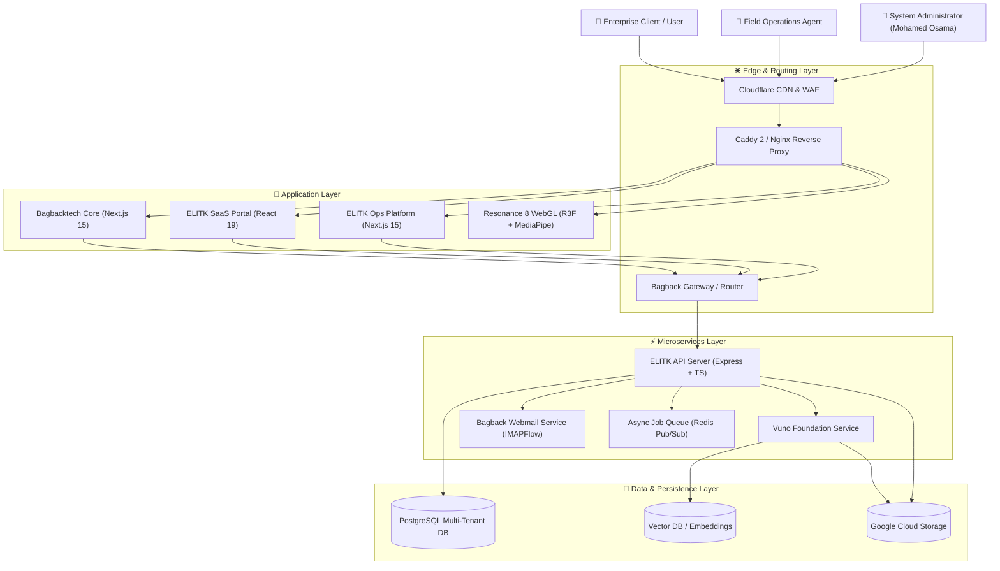

<div align="center">

# 🏛️ Systems Architecture & Engineering Portfolio
### High-Concurrency Microservices, Multi-Tenant SaaS Engines & Real-Time Field Systems

**Mohamed Osama** — Founder & Lead Systems Architect @ [Bagback Digital Solutions](https://bagbacktech.com/ar)

[](https://github.com/users/mohamedosamaai/projects/12)
[](https://github.com/mohamedosamaai/mohamedosamaai/actions)
[](https://github.com/mohamedosamaai/mohamedosamaai/security/code-scanning)
[](https://www.typescriptlang.org)
[](https://react.dev)
[](https://nextjs.org)
[](https://www.postgresql.org)
[](https://orm.drizzle.team)
[](https://www.docker.com)

---

</div>

## 👤 Executive Overview

I am Mohamed Osama, Founder & Lead Systems Architect at Bagback Digital Solutions. This repository serves as the primary technical blueprint and architectural hub for 17 production platforms, microservice engines, and enterprise solutions built across my engineering practice.

I design scalable, resilient software infrastructures — bridging client-side 3D WebGL rendering and real-time computer vision with robust multi-tenant backends, event-driven web sockets, and zero-downtime microservices.

---

## 🌐 Production Platforms & Live Systems

| Platform / System | Live Production URL | Technical Architecture & Capabilities |
| :--- | :--- | :--- |
| **Bagback Digital Solutions** | [bagbacktech.com/ar](https://bagbacktech.com/ar) | Flagship agency engine, Genkit AI integration (`@genkit-ai/vertexai`), Dialogflow CX, SSG/ISR locale caching |
| **ELITK Enterprise SaaS** | [elitk.com](https://elitk.com) | Multi-tenant workspace engine, document analytics, React 19, AWS S3 storage SDK, DND Kit workspace UI |
| **ELITK Operations Engine** | [ops.bagbacktech.com](https://ops.bagbacktech.com) | Real-time field dispatch, Firebase Admin & Cloud Tasks queues, automated work order telemetry tracking |
| **Resonance 8 WebGL Hub** | [8.elitk.com](https://8.elitk.com) | High-performance 3D graphics visualizer using React Three Fiber (`@react-three/fiber`), MediaPipe FaceMesh & GLSL Shaders |
| **LaForma Enterprise Real Estate** | [laforma.ae](https://laforma.ae) | Brokerage operations engine, real estate development catalog, Radix UI components & lead intake webhooks |
| **Bagback Commerce Hub** | [bagback.shop](https://bagback.shop) | Multi-vendor e-commerce checkout engine, Stripe API integration & automated inventory synchronization |

---

## 🏛️ 3-Tier Enterprise System Architecture

The microservice portfolio is structured across a 3-tier decoupled system architecture:

```
                  ┌─────────────────────────────────────────────────────────┐
                  │          TIER 3: ENTERPRISE & CLIENT SOLUTIONS          │
                  │   Commerce Core • LaForma Web & Ops • Vuno Broker Hub   │
                  └────────────────────────────┬────────────────────────────┘
                                               │
                                               ▼
                  ┌─────────────────────────────────────────────────────────┐
                  │         TIER 2: DEVELOPER INFRASTRUCTURE LAYER          │
                  │  Ops Platform • Webmail Engine • VPS Proxy • Bot Array │
                  └────────────────────────────┬────────────────────────────┘
                                               │
                                               ▼
                  ┌─────────────────────────────────────────────────────────┐
                  │               TIER 1: CORE PLATFORMS LAYER              │
                  │  Bagback Core • ELITK SaaS • API Server • DB • WebGL    │
                  └─────────────────────────────────────────────────────────┘
```

### Complete 17-Module System Matrix

| Layer / Tier | Module | Core Tech Stack | Technical Scope & Responsibility |
| :--- | :--- | :--- | :--- |
| **Tier 1: Core** | `bagbacktech-core` | Next.js 15, Genkit AI, TailwindCSS | Corporate web engine, Genkit AI integration & i18n locale routing |
| **Tier 1: Core** | `elitk-saas-web` | React 19, Vite, AWS S3 SDK, Zustand | Multi-tenant customer dashboard, UI workspace & real-time analytics |
| **Tier 1: Core** | `elitk-api-server` | Express.js, TypeScript, SSE, WebSockets | Central API Gateway, async job dispatch & request deduplication |
| **Tier 1: Core** | `elitk-db-schema` | Drizzle ORM, PostgreSQL, Redis | Multi-tenant schema migrations, index optimization & caching strategy |
| **Tier 1: Core** | `vuno-ai-foundation` | Python, Vertex AI SDK, Vector DB | Semantic document intelligence engine, vector search & contextual retrieval |
| **Tier 1: Core** | `resonance-8-webgl` | Three.js, React Three Fiber, MediaPipe | 3D graphics rendering engine, FaceMesh tracking & GPGPU visualizer |
| **Tier 2: Infra** | `elitk-ops-platform` | Next.js 15, Firebase Admin, Cloud Tasks | Operational dispatch system, task queues & telemetry tracking engine |
| **Tier 2: Infra** | `bagback-webmail` | Next.js 15, IMAPFlow, Mailparser, Nodemailer | Enterprise webmail engine, async IMAP streaming & transactional queues |
| **Tier 2: Infra** | `bagback-vps-server` | OVH VPS, Docker Compose, Caddy 2, WireGuard | Production infrastructure server, Caddy 2 reverse proxy & WireGuard VPN |
| **Tier 2: Infra** | `bagback-telegram-bot` | Python 3.12, Gemini 2.5 Flash, Docker | High-speed automated Telegram operations bot array & webhook worker |
| **Tier 2: Infra** | `ai-prompts-library` | TypeScript, Pydantic, JSON Schema | Versioned prompt repository, system instruction registry & guardrails |
| **Tier 2: Infra** | `bagback-infra-docker` | Docker, Compose, Nginx, Certbot | Containerized reverse proxy setup, SSL auto-renewal & container stack |
| **Tier 2: Infra** | `bagback-ci-actions` | GitHub Actions, Shell, CodeQL | Shared CI/CD reusable workflows, SAST security templates & release scripts |
| **Tier 3: Solutions** | `bagback-commerce-core` | Next.js 15, Stripe API, TailwindCSS | Multi-vendor commerce checkout engine, cart state & inventory sync |
| **Tier 3: Solutions** | `laforma-client-web` | React 19, Vite, Radix UI | Client portal for real estate developments & interactive unit catalog |
| **Tier 3: Solutions** | `laforma-ops-app` | Kotlin, Android SDK, Firebase | Mobile field application for property inspectors & sales agents |
| **Tier 3: Solutions** | `vouno-broker-platform` | Next.js 15, PostgreSQL, jsPDF | Brokerage analytics, automated PDF report generation & deal workflow |

---

## 📐 C4 Model — System Context Diagram



---

## 📚 Architectural Wiki Documentation

Detailed technical documentation and developer guides are published in the GitHub Wiki:

1. [📘 Home](.github/wiki/Home.md): System Philosophy, Monorepo Architecture & Governance.
2. [📐 System Architecture](.github/wiki/System-Architecture.md): C4 Context and Container Level Diagrams.
3. [🔄 Data Flow & Sequence](.github/wiki/Data-Flow-and-Sequence.md): Async Jobs, SSE Streams, and WebSocket Protocols.
4. [🔒 Security & Multi-Tenancy](.github/wiki/Security-and-Multi-Tenancy.md): Multi-Tenant Isolation Model, JWT Security & Offline Mocks.
5. [🔌 API & Integrations](.github/wiki/API-and-Integrations.md): RESTful Endpoints, Request Deduplication & OpenAPI Specifications.
6. [💻 Developer Setup](.github/wiki/Developer-Setup.md): Local Environment Playbook, Variables & Execution Commands.

---

## ⚙️ Execution Commands & Local Usage

```bash
# Clone the repository
git clone https://github.com/mohamedosamaai/mohamedosamaai.git
cd mohamedosamaai

# Install dependencies with lockfile verification
npm install

# Run strict TypeScript type check
npm run type-check

# Execute local showcase generator tool
npm run showcase:generate
```

---

## 🛡️ Engineering Standards

- **Strict Type Safety:** All packages enforce TypeScript strict mode with zero implicit `any`.
- **Clean Architecture:** Domain logic is decoupled from UI presentation and database persistence.
- **Showcase Branch Hygiene:** Clean remote branch structure (`main` and verified integrations only).
- **Code Ownership:** Primary code review and architecture approvals managed by `@mohamedosamaai`.

---

<div align="center">

**© 2026 Mohamed Osama — Founder @ Bagback Digital Solutions.** All rights reserved.

</div>
