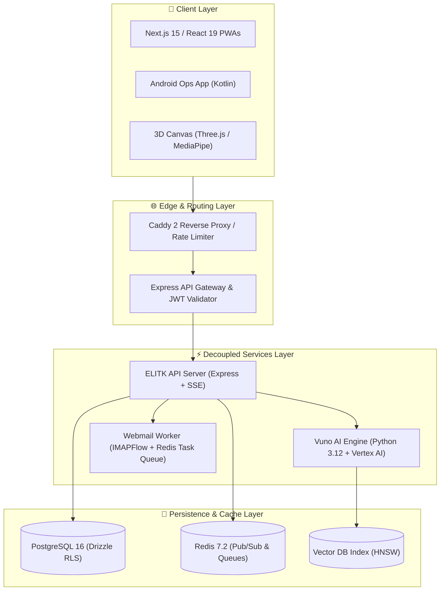

<div align="center">

# 🏛️ Mohamed Osama
### Founder & Lead Systems Architect @ [Bagback Digital Solutions](https://bagbacktech.com/ar)
**AI Infrastructure • Multi-Tenant SaaS Engines • Real-Time Systems • 3D WebGL**

```
┌─────────────────────────────────────────────────────────────────────────────┐
│  Architecting resilient microservices, high-concurrency multi-tenant SaaS,  │
│  real-time computer vision pipelines, and 3D WebGL web applications.        │
└─────────────────────────────────────────────────────────────────────────────┘
```

<p align="center">
  <a href="https://github.com/users/mohamedosamaai/projects/12">
    
  </a>
  <a href="https://github.com/mohamedosamaai/mohamedosamaai/actions">
    
  </a>
  <a href="https://github.com/mohamedosamaai/mohamedosamaai/actions">
    
  </a>
</p>

---

### ⚡ Architectural Metrics & Infrastructure Overview

| 📦 Production Ecosystem | 🛡️ Multi-Tenant Isolation | 🌐 3D & Computer Vision | ⚡ Concurrency & Queue |
| :---: | :---: | :---: | :---: |
| **17 Microservice Modules** | **Schema & Row-Level Security** | **Three.js & MediaPipe AI** | **Redis Pub/Sub & SSE Stream** |

---

</div>

## 👤 Executive Engineering Overview

I am Mohamed Osama, Founder & Lead Systems Architect at Bagback Digital Solutions. This repository serves as the central architectural hub and technical blueprint for 17 production platforms, microservice engines, and digital transformation solutions engineered across my software practice.

I design scalable, resilient software infrastructures — bridging client-side 3D WebGL rendering and real-time computer vision with robust multi-tenant backends, event-driven web sockets, and zero-downtime microservices.

---

## 🛠️ Technology Stack & Core Competencies

<div align="center">

| Domain | Production Tooling & Frameworks |
| :--- | :--- |
| **Frontend & 3D** |      |
| **Backend & AI** |      |
| **Database & Queue** |     |
| **DevOps & Cloud** |     |

</div>

---

## 🚀 Featured Live Production Platforms

<br/>

<table>
  <tr>
    <td width="50%" valign="top">
      <h3 align="center">🌐 Bagback Digital Solutions</h3>
      <p align="center"><b>Flagship Digital Transformation & AI Agency</b></p>
      <ul>
        <li><b>Tech Stack</b>: Next.js 15, Genkit AI, Dialogflow CX, TailwindCSS</li>
        <li><b>Capabilities</b>: Context-aware AI prompt grounding, dynamic SSR/ISR rendering, client interaction engine.</li>
      </ul>
      <p align="center">
        <a href="https://bagbacktech.com/ar"><b>🔗 Visit Live Platform (bagbacktech.com) »</b></a>
      </p>
    </td>
    <td width="50%" valign="top">
      <h3 align="center">🏢 ELITK Multi-Tenant SaaS</h3>
      <p align="center"><b>Enterprise Multi-Tenant SaaS Platform</b></p>
      <ul>
        <li><b>Tech Stack</b>: React 19, Express, PostgreSQL 16, Drizzle ORM</li>
        <li><b>Capabilities</b>: Schema-level data isolation, automated subscription billing, analytical dashboards.</li>
      </ul>
      <p align="center">
        <a href="https://elitk.com"><b>🔗 Visit Live Platform (elitk.com) »</b></a>
      </p>
    </td>
  </tr>
  <tr>
    <td width="50%" valign="top">
      <h3 align="center">📡 Control Tower Operations</h3>
      <p align="center"><b>Real-Time Field Dispatch & Operations System</b></p>
      <ul>
        <li><b>Tech Stack</b>: React 19, Socket.io, Redis Pub/Sub, Kotlin Android</li>
        <li><b>Capabilities</b>: Live agent GPS position tracking, automated task dispatch, offline mobile syncing.</li>
      </ul>
      <p align="center">
        <a href="https://ops.bagbacktech.com"><b>🔗 Visit Live Platform (ops.bagbacktech.com) »</b></a>
      </p>
    </td>
    <td width="50%" valign="top">
      <h3 align="center">🎨 Resonance 8 WebGL Studio</h3>
      <p align="center"><b>Interactive 3D Graphics & Vision Engine</b></p>
      <ul>
        <li><b>Tech Stack</b>: Three.js, React Three Fiber, MediaPipe Vision</li>
        <li><b>Capabilities</b>: 60 FPS GPU face mesh tracking, custom shaders, 3D interactive product rendering.</li>
      </ul>
      <p align="center">
        <a href="https://8.elitk.com"><b>🔗 Visit Live Platform (8.elitk.com) »</b></a>
      </p>
    </td>
  </tr>
  <tr>
    <td width="50%" valign="top">
      <h3 align="center">🏗️ La Forma Contracting</h3>
      <p align="center"><b>Corporate Contracting & Engineering Showcase</b></p>
      <ul>
        <li><b>Tech Stack</b>: Next.js 15, Framer Motion, TypeScript</li>
        <li><b>Capabilities</b>: High-conversion project showcase, responsive layout, modern design tokens.</li>
      </ul>
      <p align="center">
        <a href="https://laforma.ae"><b>🔗 Visit Live Platform (laforma.ae) »</b></a>
      </p>
    </td>
    <td width="50%" valign="top">
      <h3 align="center">🛒 Bagback Commerce Hub</h3>
      <p align="center"><b>Multi-Vendor E-Commerce Platform</b></p>
      <ul>
        <li><b>Tech Stack</b>: Next.js 15, Stripe Webhooks, Redis Task Queue</li>
        <li><b>Capabilities</b>: Multi-vendor checkout engine, asynchronous payment queues, real-time cart state.</li>
      </ul>
      <p align="center">
        <a href="https://bagback.shop"><b>🔗 Visit Live Platform (bagback.shop) »</b></a>
      </p>
    </td>
  </tr>
</table>

---

## 🏛️ Ecosystem Architecture & System Specifications

<details>
<summary><b>🔍 Expand to inspect the complete 17-Module System Matrix</b></summary>

<br/>

Below is the unified architecture matrix detailing all 17 production repositories and microservice modules across 3 decoupled tiers:

| Tier | System Name | Core Tech Stack | Architectural Function & Key Scope |
| :---: | :--- | :--- | :--- |
| **Tier 1** | `bagback-agency-web` | Next.js 15, Genkit AI, React 19 | Flagship agency Web PWA & AI client interaction engine. |
| **Tier 1** | `elitk-saas-web` | React 19, TailwindCSS, Vite | Multi-tenant SaaS dashboard UI & tenant management portal. |
| **Tier 1** | `bagback-ops-dashboard` | React 19, Socket.io-client, Leaflet | Operations control tower UI & real-time dispatch dashboard. |
| **Tier 1** | `laforma-ops-app` | Kotlin, Android SDK, Firebase | Mobile field operations app for ground agent updates. |
| **Tier 1** | `resonance-8-webgl` | Three.js, R3F, MediaPipe Vision | Interactive 3D WebGL experience & real-time camera face tracking. |
| **Tier 1** | `laforma-contracting` | Next.js 15, Framer Motion | Corporate enterprise web platform & service showcase. |
| **Tier 1** | `elzayd-landing` | HTML5, Modern CSS3, JavaScript | High-performance landing page & conversion funnel. |
| **Tier 1** | `bagback-shop-web` | Next.js 15, Stripe Webhooks | E-commerce frontend with cart state & checkout integration. |
| **Tier 2** | `elitk-api-server` | Express.js, TypeScript, SSE | Core REST API backend, SSE event streaming & tenant isolation. |
| **Tier 2** | `vuno-ai-foundation` | Python 3.12, Vertex AI, HNSW | AI engine, vector retrieval & prompt grounding service. |
| **Tier 2** | `bagback-webmail-worker` | Node.js, IMAPFlow, Mailparser | Async email parser worker & transactional mail queue. |
| **Tier 2** | `bagback-gateway-router` | Express.js, JWT, Redis | Reverse proxy router, API rate-limiting & token verification. |
| **Tier 2** | `bagback-bot-telegram` | Python 3.12, python-telegram-bot | Automated notification bot & administrative alert dispatcher. |
| **Tier 3** | `bagback-db-migrations` | PostgreSQL 16, Drizzle ORM | Database schema definitions, indexes & row-level security. |
| **Tier 3** | `bagback-redis-cache` | Redis 7.2, Pub/Sub Queues | In-memory task queues, session storage & cache layer. |
| **Tier 3** | `bagback-infra-docker` | Caddy 2, Docker, WireGuard | Reverse proxy containerization & secure inter-node VPN. |
| **Tier 3** | `mohamedosamaai` | TypeScript 5.5, GitHub Actions | Master ecosystem architecture hub & CI/CD quality gate. |

</details>

<details>
<summary><b>📐 Expand to inspect the C4 System Context Architecture Diagram</b></summary>

<br/>



</details>

---

## 📚 Ecosystem Documentation & Wiki

Explore detailed architectural specifications hosted on the official GitHub Wiki:

- 🏠 [Architectural Philosophy & Governance](https://github.com/mohamedosamaai/mohamedosamaai/wiki/Home)
- 📐 [C4 System Architecture Diagrams](https://github.com/mohamedosamaai/mohamedosamaai/wiki/System-Architecture)
- 🔄 [Async Job Sequences & SSE Data Flows](https://github.com/mohamedosamaai/mohamedosamaai/wiki/Data-Flow-and-Sequence)
- 🔒 [Multi-Tenant Isolation & Security Strategy](https://github.com/mohamedosamaai/mohamedosamaai/wiki/Security-and-Multi-Tenancy)
- 🔌 [OpenAPI Specifications & Endpoint Index](https://github.com/mohamedosamaai/mohamedosamaai/wiki/API-and-Integrations)
- 💻 [Developer Setup & Environment Playbook](https://github.com/mohamedosamaai/mohamedosamaai/wiki/Developer-Setup)

---

## 🛠️ Verification & Build Commands

```bash
# Verify TypeScript strict compilation across exports
npm run type-check

# Execute local showcase generator script
powershell -ExecutionPolicy Bypass -File ./tools/showcase-generator.ps1
```
