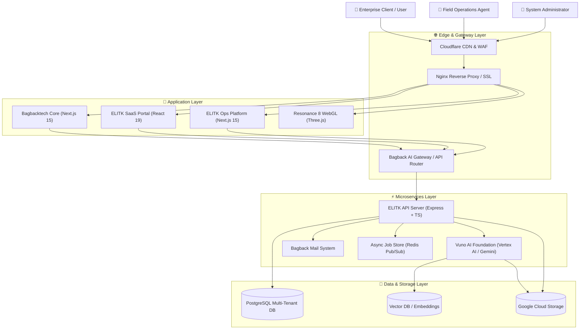

<div align="center">

# 🏛️ Master Ecosystem Architecture Hub & System Blueprint
### AI Infrastructure, Multi-Tenant SaaS Platforms & Distributed Microservices Organization

**Architect & Lead Engineer:** [Mohamed Osama](https://github.com/mohamedosamaai) (Founder & Lead Architect @ [Bagback Digital Solutions](https://bagbacktech.com/ar))

[](https://github.com/mohamedosamaai/mohamedosamaai/actions)
[](https://github.com/mohamedosamaai/mohamedosamaai/security/code-scanning)
[](https://www.typescriptlang.org)
[](https://react.dev)
[](https://nextjs.org)
[](https://www.postgresql.org)
[](https://orm.drizzle.team)
[](https://www.docker.com)
[](https://ai.google.dev)

---

</div>

## 👤 Executive Narrative & Vision

> *"Modern enterprise applications demand strict separation of concerns, multi-tenant security guarantees, low-latency AI retrieval pipelines, and bulletproof CI/CD quality gates. As Digital Transformation Architect and Founder at Bagback Digital Solutions, my focus is designing resilient distributed ecosystems that seamlessly scale from high-concurrency 3D WebGL experiences to zero-downtime microservices and autonomous AI agent workflows."*
> — **Mohamed Osama**

This repository serves as the **Master System Blueprint** and architectural reference hub across our organization's 17 core platforms, developer infrastructure tools, and client enterprise solutions.

---

## 🚀 Live Interactive Demos & Platform Hubs

| Platform / Product | Live Production URL | Core Capabilities |
| :--- | :--- | :--- |
| **Bagback Digital Solutions** | [bagbacktech.com/ar](https://bagbacktech.com/ar) | Primary corporate portal, digital transformation ecosystem & agency engine |
| **ELITK Enterprise SaaS** | [elitk.com](https://elitk.com) | Multi-tenant SaaS workspace, AI document parsing & tenant management |
| **ELITK Operations Engine** | [ops.bagbacktech.com](https://ops.bagbacktech.com) | Field operations dispatch, real-time tracking & automated work order queue |
| **Resonance 8 WebGL Hub** | [8.elitk.com](https://8.elitk.com) | High-performance 3D WebGL interactive visualization & GPGPU shader suite |
| **LaForma Enterprise Real Estate** | [laforma.ae](https://laforma.ae) | Broker operations platform, property catalog & high-speed lead management |
| **Bagback Commerce Hub** | [bagback.shop](https://bagback.shop) | Multi-vendor e-commerce marketplace & automated payment gateway |

---

## 🏛️ 3-Tier Ecosystem Repository Architecture

The organization's microservices and software modules are cataloged across a 3-Tier Enterprise Architecture:

```
                  ┌─────────────────────────────────────────────────────────┐
                  │          TIER 3: ENTERPRISE & CLIENT SOLUTIONS          │
                  │   Commerce Core • LaForma Web & Ops • Vuno Broker Hub   │
                  └────────────────────────────┬────────────────────────────┘
                                               │
                                               ▼
                  ┌─────────────────────────────────────────────────────────┐
                  │         TIER 2: DEVELOPER INFRASTRUCTURE LAYER          │
                  │   Ops Platform • Prompts Library • Mail • AI Gateway   │
                  └────────────────────────────┬────────────────────────────┘
                                               │
                                               ▼
                  ┌─────────────────────────────────────────────────────────┐
                  │               TIER 1: CORE PLATFORMS LAYER              │
                  │  Bagback Core • ELITK SaaS • API Server • DB • WebGL    │
                  └─────────────────────────────────────────────────────────┘
```

### Complete 17-Repository Architectural Matrix

| Layer / Tier | Repository Name | Primary Tech Stack | Architectural Responsibility |
| :--- | :--- | :--- | :--- |
| **Tier 1: Core** | `bagbacktech-core` | Next.js 15, TypeScript, TailwindCSS | Corporate flagship Web engine, SSG/ISR caching, i18n locale routing |
| **Tier 1: Core** | `elitk-saas-web` | React 19, Vite, TailwindCSS, Zustand | Main multi-tenant customer dashboard, UI workspace & real-time analytics |
| **Tier 1: Core** | `elitk-api-server` | Express.js, TypeScript, SSE, WebSockets | Central API Gateway, async job dispatch, rate limiting & request deduplication |
| **Tier 1: Core** | `elitk-db-schema` | Drizzle ORM, PostgreSQL, Redis | Multi-tenant isolated schema migrations, index optimization & caching strategy |
| **Tier 1: Core** | `vuno-ai-foundation` | Python, Vertex AI, Gemini 1.5, Vector DB | AI foundation engine, RAG retrieval pipelines, context insertion & prompt chains |
| **Tier 1: Core** | `resonance-8-webgl` | Three.js, WebGL2, GLSL Shaders, React | Interactive 3D graphics rendering engine, particle systems & visualizer |
| **Tier 2: Infra** | `elitk-ops-platform` | Next.js 15, Firebase Admin, Cloud Tasks | Operational management system, automated task queues & telemetry tracking |
| **Tier 2: Infra** | `ai-prompts-library` | TypeScript, Pydantic, JSON Schema | Versioned prompt repository, system instruction registry & guardrail specs |
| **Tier 2: Infra** | `bagback-mail-system` | Next.js 15, Nodemailer, SMTP Worker | Enterprise webmail client, transactional email queues & template renderer |
| **Tier 2: Infra** | `bagback-ai-gateway` | Node.js, Express, Google AI Studio SDK | LLM abstraction gateway, provider failover fallback & token counter |
| **Tier 2: Infra** | `bagback-infra-docker` | Docker, Compose, Nginx, Certbot | Containerized reverse proxy setup, SSL auto-renewal & container orchestration |
| **Tier 2: Infra** | `bagback-ci-actions` | GitHub Actions, Shell, CodeQL | Shared CI/CD reusable workflows, SAST security templates & release scripts |
| **Tier 3: Solutions** | `bagback-commerce-core` | Next.js 15, Stripe API, TailwindCSS | Multi-vendor commerce checkout engine, cart state & inventory sync |
| **Tier 3: Solutions** | `laforma-client-web` | React 19, Vite, TailwindCSS | Client-facing portal for real estate developments & interactive unit catalog |
| **Tier 3: Solutions** | `laforma-ops-app` | Kotlin, Android SDK, Firebase | Mobile field application for property inspectors & sales agents |
| **Tier 3: Solutions** | `vouno-broker-platform` | Next.js 15, PostgreSQL, Drizzle ORM | Brokerage analytics, commission calculator & deal workflow engine |
| **Tier 3: Solutions** | `bagback-marketing-engine` | HTML5, Vanilla JS, CSS3 | High-converting landing page engine, lead intake webhooks & CRM sync |

---

## 📐 C4 Model — System Context Diagram



---

## 📚 Architecture Documentation Wiki

Comprehensive architectural blueprints and developer documentation are structured in the [.github/wiki](./.github/wiki) directory:

1. [📘 Home](.github/wiki/Home.md): System Vision, Monorepo Architecture & Governance.
2. [📐 System Architecture](.github/wiki/System-Architecture.md): C4 Context and Container Level Diagrams.
3. [🔄 Data Flow & Sequence](.github/wiki/Data-Flow-and-Sequence.md): Async Jobs, SSE Streams, and WebSocket Protocols.
4. [🔌 API & Integrations](.github/wiki/API-and-Integrations.md): RESTful Endpoints, Deduplication & SSE Specifications.
5. [🔒 Security & Mock Strategy](.github/wiki/Security-and-Mock-Strategy.md): Multi-Tenant Isolation, JWT & Offline Mocks.
6. [💻 Developer Setup](.github/wiki/Developer-Setup.md): Local Prerequisites, Environment Variables & Execution Commands.

---

## ⚙️ Quick Start for Developers

```bash
# Clone the master ecosystem hub repository
git clone https://github.com/mohamedosamaai/mohamedosamaai.git
cd mohamedosamaai

# Install dependencies with exact lockfile matching
npm install

# Run strict TypeScript type check
npm run type-check

# Execute local showcase generator tool
npm run showcase:generate
```

---

## 🛡️ Security & Governance

- **Strict Type Safety:** All packages enforce TypeScript strict mode with zero implicit `any`.
- **Clean Architecture:** Domain logic is decoupled from UI presentation and database persistence.
- **Branch Hygiene:** Remote branch structure is strictly managed (`main` and clean integrations only).
- **Code Owners:** Security and architecture approvals managed by `@mohamedosamaai`.

---

<div align="center">

**© 2026 Mohamed Osama — Bagback Digital Solutions.** All rights reserved.

</div>
