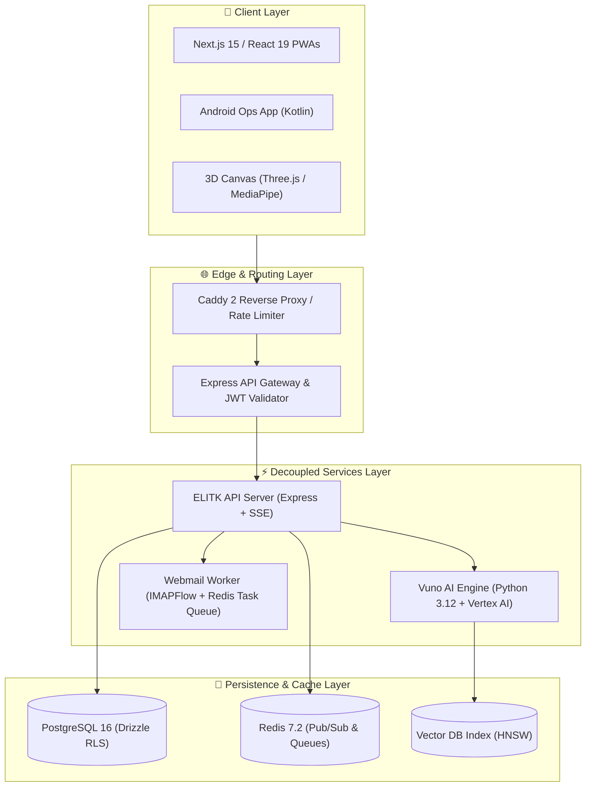

<div align="center">

# 🏛️ Systems Architecture & Engineering Portfolio
### High-Concurrency Microservices, Multi-Tenant SaaS Engines & Real-Time Field Systems
**Mohamed Osama** — Founder & Lead Systems Architect @ [Bagback Digital Solutions](https://bagbacktech.com/ar)

[](https://github.com/users/mohamedosamaai/projects/12)
[](https://github.com/mohamedosamaai/mohamedosamaai/actions)
[](https://github.com/mohamedosamaai/mohamedosamaai/actions)
[](https://www.typescriptlang.org/)
[](https://python.org)
[](https://kotlinlang.org)

</div>

---

## 👤 Executive Overview

I am Mohamed Osama, Founder & Lead Systems Architect at Bagback Digital Solutions. This master repository serves as the unified technical blueprint and architectural hub for 17 production platforms, microservice engines, and enterprise solutions developed across my software practice.

My work spans high-concurrency microservices, multi-tenant database isolation, real-time WebSocket/SSE event streaming, high-performance 3D WebGL experiences, and cloud-native AI integrations.

---

## 🚀 Featured Live Platforms

<div align="center">

| Platform | Production URL | Core Technology Stack | Architectural Highlights |
| :--- | :--- | :--- | :--- |
| **Bagback Digital Solutions** | [bagbacktech.com/ar](https://bagbacktech.com/ar) | Next.js 15, Genkit AI, TailwindCSS | Flagship agency engine, AI prompt context integration, Dialogflow CX, SSE caching. |
| **ELITK Multi-Tenant SaaS** | [elitk.com](https://elitk.com) | React 19, Express, PostgreSQL, Drizzle ORM | Multi-tenant SaaS engine, schema-level tenant isolation, automated subscription billing. |
| **Operations Control Tower** | [ops.bagbacktech.com](https://ops.bagbacktech.com) | React 19, Socket.io, Redis, Kotlin Android | Real-time field operations, live GPS agent tracking, automated dispatch queues. |
| **Resonance 8 WebGL Studio** | [8.elitk.com](https://8.elitk.com) | Three.js, React Three Fiber, MediaPipe Vision | 3D interactive graphics, GPU shader landmark mapping, real-time computer vision. |
| **La Forma Contracting** | [laforma.ae](https://laforma.ae) | Next.js 15, TypeScript, Framer Motion | High-conversion enterprise portfolio, responsive SSR layout, modern UI design tokens. |
| **Bagback Commerce Hub** | [bagback.shop](https://bagback.shop) | Next.js 15, Stripe API, Redis Pub/Sub | E-commerce engine, multi-vendor cart state, asynchronous webhook payment queues. |

</div>

---

## 🏗️ Consolidated Master Architecture Matrix (17 Systems)

Below is the definitive, unified architecture matrix mapping all 17 production repositories and microservice modules by architecture tier, technical stack, and system scope:

| Tier | System Name | Core Tech Stack | Architectural Function & Key Scope |
| :---: | :--- | :--- | :--- |
| **Tier 1** | `bagback-agency-web` | Next.js 15, Genkit AI, React 19 | Flagship agency Web PWA & AI client interaction engine. |
| **Tier 1** | `elitk-saas-web` | React 19, TailwindCSS, Vite | Multi-tenant SaaS dashboard UI & tenant management portal. |
| **Tier 1** | `bagback-ops-dashboard` | React 19, Socket.io-client, Leaflet | Operations control tower UI & real-time dispatch dashboard. |
| **Tier 1** | `laforma-ops-app` | Kotlin, Android SDK, Firebase | Mobile field operations app for ground agent updates. |
| **Tier 1** | `resonance-8-webgl` | Three.js, R3F, MediaPipe Vision | Interactive 3D WebGL experience & real-time camera face tracking. |
| **Tier 1** | `laforma-contracting` | Next.js 15, Framer Motion | Corporate enterprise web platform & service showcase. |
| **Tier 1** | `elzayd-landing` | HTML5, Modern CSS3, JavaScript | High-performance landing page & conversion funnel. |
| **Tier 1** | `bagback-shop-web` | Next.js 15, Stripe Webhooks | E-commerce frontend with cart state & checkout integration. |
| **Tier 2** | `elitk-api-server` | Express.js, TypeScript, SSE | Core REST API backend, SSE event streaming & tenant isolation. |
| **Tier 2** | `vuno-ai-foundation` | Python 3.12, Vertex AI, HNSW | AI engine, vector retrieval & prompt grounding service. |
| **Tier 2** | `bagback-webmail-worker` | Node.js, IMAPFlow, Mailparser | Async email parser worker & transactional mail queue. |
| **Tier 2** | `bagback-gateway-router` | Express.js, JWT, Redis | Reverse proxy router, API rate-limiting & token verification. |
| **Tier 2** | `bagback-bot-telegram` | Python 3.12, python-telegram-bot | Automated notification bot & administrative alert dispatcher. |
| **Tier 3** | `bagback-db-migrations` | PostgreSQL 16, Drizzle ORM | Database schema definitions, indexes & row-level security. |
| **Tier 3** | `bagback-redis-cache` | Redis 7.2, Pub/Sub Queues | In-memory task queues, session storage & cache layer. |
| **Tier 3** | `bagback-infra-docker` | Caddy 2, Docker, WireGuard | Reverse proxy containerization & secure inter-node VPN. |
| **Tier 3** | `mohamedosamaai` | TypeScript 5.5, GitHub Actions | Master ecosystem architecture hub & CI/CD quality gate. |

---

## 📐 C4 System Context Architecture

The diagram below illustrates the high-level boundary between clients, edge proxies, microservice runtimes, and persistence layers:



---

## 📚 Ecosystem Documentation & Wiki

Explore detailed architectural specifications hosted on the official GitHub Wiki:

- 🏠 [Architectural Philosophy & Governance](https://github.com/mohamedosamaai/mohamedosamaai/wiki/Home)
- 📐 [C4 System Architecture Diagrams](https://github.com/mohamedosamaai/mohamedosamaai/wiki/System-Architecture)
- 🔄 [Async Job Sequences & SSE Data Flows](https://github.com/mohamedosamaai/mohamedosamaai/wiki/Data-Flow-and-Sequence)
- 🔒 [Multi-Tenant Isolation & Security Strategy](https://github.com/mohamedosamaai/mohamedosamaai/wiki/Security-and-Multi-Tenancy)
- 🔌 [OpenAPI Specifications & Endpoint Index](https://github.com/mohamedosamaai/mohamedosamaai/wiki/API-and-Integrations)
- 💻 [Developer Setup & Environment Playbook](https://github.com/mohamedosamaai/mohamedosamaai/wiki/Developer-Setup)

---

## 🛠️ Verification & Build Commands

```bash
# Verify TypeScript strict compilation across exports
npm run type-check

# Execute local showcase generator script
powershell -ExecutionPolicy Bypass -File ./tools/showcase-generator.ps1
```
