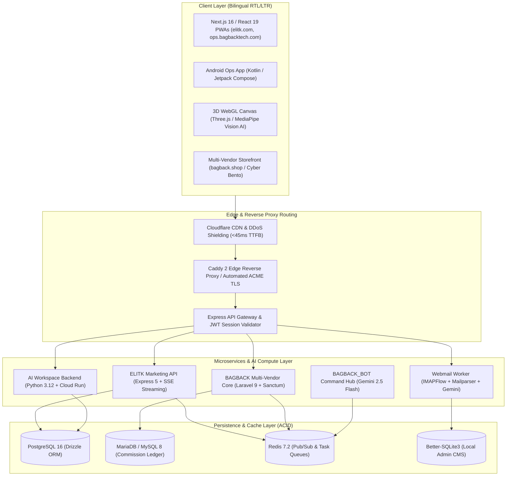

  <!-- Animated Cyber Typing SVG Header -->
  

   

  <!-- Tagline -->
  

    <b>Enterprise AI Systems • Distributed Multi-Tenant Backends • Real-Time Attribution • 3D WebGL • DevSecOps</b>
  

  <!-- Authority & Accreditations Badge Hub -->
  

    
    
    
    
    
    
  

  <!-- Government & Enterprise Credentials -->
  

    
    
    
    
    
  

---

## 🧊 3D Contribution Landscape & Activity Grid

  <picture>
    <source media="(prefers-color-scheme: dark)" srcset="https://raw.githubusercontent.com/mohamedosamaai/mohamedosamaai/main/profile-3d-contrib/profile-night-rainbow.svg">
    <source media="(prefers-color-scheme: light)" srcset="https://raw.githubusercontent.com/mohamedosamaai/mohamedosamaai/main/profile-3d-contrib/profile-green-animate.svg">
    
  </picture>

---

## 🏛️ Executive Engineering Overview

I am **Mohamed Osama**, Founder & Lead AI Systems Architect at **Bagback Digital Solutions** (CR: `218773`, Tax ID: `757-139-248`, Dubai, UAE & Cairo, Egypt).

I architect and deliver sovereign digital platforms, resilient multi-tenant backends, real-time conversion attribution engines, and interactive WebGL/Three.js spatial applications. Every platform in this ecosystem is engineered under strict type safety contracts, deterministic CI/CD pipelines, zero-CVE security baselines, and Sigstore SLSA Level 3 provenance verification.

---

## 🌐 Flagship Production Ecosystem (Live Platforms)

The following platforms represent the active live production platforms engineered and operated across the ecosystem (as featured on [mohamedosama.me/work](https://mohamedosama.me/work)):

| # | Platform | Live Domain | Core Tech Stack | Architectural Function & Production Scope | Classification |
| :-: | :--- | :--- | :--- | :--- | :---: |
| **1** | **Elitk** | [elitk.com](https://elitk.com) | Express 5, React 18, Vite 7, PostgreSQL 16, Drizzle, Vertex AI | **AI Social Media Operations SaaS:** Arabic-first social media operating system featuring multi-account scheduling, ad management, WhatsApp inbox, performance analytics, and AI copy generation. | `LIVE PRODUCTION` |
| **2** | **Ops (ERP)** | [ops.bagbacktech.com](https://ops.bagbacktech.com) | Next.js 15, React 19, Firebase Admin, Serwist PWA, Kotlin Android | **Field Operations ERP (Arabic-first):** Multi-tenant field operations platform for technical service companies in the UAE & KSA. Real-time GPS tracking, task dispatch, and offline PWA sync. | `LIVE PRODUCTION` |
| **3** | **BagbackTech** | [bagbacktech.com](https://bagbacktech.com) | Next.js 15.5, Genkit AI, Dialogflow CX, Firebase Admin, TailwindCSS | **Digital Product Studio & Startup Enablement:** Flagship AI studio platform for Bagback Digital Solutions. Services portal, multi-agent ideation workflows, and startup incubation. | `LIVE PRODUCTION` |
| **4** | **mail elitk** | [mail.bagbacktech.com](https://mail.bagbacktech.com) | Next.js 16, React 19, IMAPFlow, Mailparser, Nodemailer, Gemini API | **Sovereign AI Email Platform:** Unified business inbox client consolidating multiple IMAP/SMTP accounts with automated bilingual triage, Gemini summaries, and transactional mail processing. | `LIVE PRODUCTION` |
| **5** | **AI Developer Workspace** | [ai.bagbacktech.com](https://ai.bagbacktech.com) | FastAPI (Python 3.12), Cloud Run, React, Cloud SQL PostgreSQL | **AI Prompt Library & Model Governance:** Internal developer knowledge base hosting 2,771 curated prompt cards, MCP tool server profiles, AI workbench, and scale-to-zero GCP backend. | `LIVE PRODUCTION` |
| **6** | **VOUNO** | [vouno.ae](https://vouno.ae) | React 19, Vite 6, Express, Google GenAI, jsPDF, TailwindCSS 4 | **UAE Trade Finance & Fintech SaaS:** Enterprise platform featuring automated trade contract advisory, zero cash margin structuring, fee calculators, and live bank guarantee verification pipelines. | `CLIENT PLATFORM` |
| **7** | **Bagback Download** | [download.bagbacktech.com](https://download.bagbacktech.com) | React 19 PWA, Vite 6, Express, TypeScript, yt-dlp, Redis | **High-Speed Cloud Media Extraction Engine:** Unified stream and media format extraction monorepo engine with async queue processing and audio extraction pipelines. | `LIVE PRODUCTION` |
| **8** | **Elitk Resonance 8** | [8.elitk.com](https://8.elitk.com) | Three.js, React Three Fiber, MediaPipe Vision, Vite 8, GLSL | **Immersive 3D WebGL & Spatial Experience:** Interactive 3D graphics studio and real-time camera face mesh tracking engine with 60 FPS GPU facial landmark mapping and audio-reactive shaders. | `LIVE PRODUCTION` |
| **9** | **Bagback Shop** | [bagback.shop](https://bagback.shop) | Laravel 9 (PHP 8.2), Vue 3, MariaDB, Redis, Stripe Connect | **Multi-Vendor Luxury Commerce Platform:** Wholesale & retail commerce platform with real-time affiliate conversion attribution engine, split payouts, and double-entry commission ledger. | `LIVE PRODUCTION` |
| **10** | **Laforma** | [laforma.ae](https://laforma.ae) | Next.js 14, React 18, TypeScript 5.9, TailwindCSS 3.4, Firebase | **Technical Services Platform (Dubai, UAE):** High-performance bilingual (Arabic/English) platform with responsive static export architecture and parallel RTL/LTR conversion funnels. | `CLIENT PLATFORM` |
| **11** | **Mohamed Osama Platform** | [mohamedosama.me](https://mohamedosama.me) | Next.js 16, React 19, Better-SQLite3, TailwindCSS 4, Caddy 2 | **Sovereign Developer Platform & CMS:** Personal developer portfolio and ecosystem command center integrated with a fast SQLite administrative CMS dashboard. | `LIVE PRODUCTION` |
| **12** | **BAGBACK_BOT** | [t.me/Bagback_bot](https://t.me/Bagback_bot) | Python 3.12, Gemini 2.5 Flash, `python-telegram-bot`, Docker | **AI Telegram Command Center:** Central Telegram command hub (`@Bagback_bot`) and automated contextual article generation engine with persistent vector knowledge retrieval. | `LIVE PRODUCTION` |
| **13** | **elzayd-landing** | [elzayd.com](https://elzayd.com) | HTML5, Modern CSS3, Schema.org JSON-LD, Cloudflare Pages | **Premium Domain Sales Platform:** Bilingual domain landing page featuring optimized conversion funnel architecture and instant escrow transaction integration. | `LIVE PRODUCTION` |

---

## 🛠️ Systems Architecture & Technology Toolbox

<table align="center" width="100%" style="border-collapse: collapse; border: none;">
  <tr style="border: none;">
    <td style="border: none; padding: 12px; vertical-align: top;" width="33%">
      <h4>🧠 AI & Distributed Engines</h4>
      

         <b>Python 3.12+</b> (FastAPI, PyTorch) 
         <b>Google Cloud Vertex AI & Gemini</b> 
         <b>TypeScript 5.7+</b> (Strict Contracts) 
         <b>Node.js & Express 5</b> 
         <b>Laravel 9 / PHP 8.2+</b>
      

    </td>
    <td style="border: none; padding: 12px; vertical-align: top;" width="33%">
      <h4>⚡ Frontend & 3D WebGL</h4>
      

         <b>React 19 & Next.js 16</b> 
         <b>Three.js & React Three Fiber</b> 
         <b>Tailwind CSS (Cyber Bento)</b> 
         <b>MediaPipe Vision AI</b> 
         <b>Vue 3 & Alpine.js</b>
      

    </td>
    <td style="border: none; padding: 12px; vertical-align: top;" width="33%">
      <h4>🛡️ Cloud, Security & Persistence</h4>
      

         <b>PostgreSQL 16 & SQLite3</b> 
         <b>Redis 7.2 (Pub/Sub Queues)</b> 
         <b>Docker & Compose</b> 
         <b>Caddy 2 & Edge Proxies</b> 
         <b>SLSA Level 3 Provenance</b>
      

    </td>
  </tr>
</table>

---

## 🏗️ C4 System Architecture Diagram

The diagram below illustrates the end-to-end architecture across client interfaces, edge reverse proxies, distributed microservices, and database persistence tiers:

---

## 🔬 Core Specialization Deep Dives

  
<b>1. Enterprise AI Systems & LLM Grounding</b> (Click to Collapse)

   
  
  - **Context-Aware Prompt Grounding:** Semantic integration with Google Cloud Vertex AI Studio and Gemini 2.5 Flash.
  - **Machine-Readable AI Contexts:** Standardized `llms.txt` and `llms-full.txt` files anchored to Wikidata Entity `Q141252311` across all domains.
  - **MCP Protocol Integrations:** High-throughput Model Context Protocol server endpoints for autonomous agent discovery.

  
<b>2. Multi-Vendor Commerce & Real-Time Attribution</b> (Click to Collapse)

   
  
  - **ACID Double-Entry Ledger:** Mathematical attribution and split disbursements for multi-merchant carts.
  - **Cryptographic Click Attribution:** Fraud-resistant IP and fingerprint hash tracking with configurable attribution windows.
  - **Idempotent Webhook Processing:** Zero-duplicate payment processing across Stripe Connect, PayTabs, and Apple Pay.

  
<b>3. 3D WebGL, Computer Vision & Spatial Audio</b> (Click to Collapse)

   
  
  - **60 FPS GPU Face Mesh Tracking:** Real-time facial landmark detection using `@mediapipe/tasks-vision` and custom GLSL shaders.
  - **Spatial WebAudio Synthesis:** Low-latency neural audio synthesis and frequency separation engines.
  - **Responsive Cyber Bento Design Tokens:** High-contrast luxury interfaces with Tailwind CSS and Lucide Icons.

  
<b>4. DevSecOps, SLSA Level 3 & Zero-CVE Baseline</b> (Click to Collapse)

   
  
  - **Sigstore Cryptographic Attestation:** Build provenance signed using `actions/attest-build-provenance@v2`.
  - **Continuous Secret Scanning:** Gitleaks automated security gate blocking unmasked credentials.
  - **Static Code Analysis:** CodeQL multi-language static scanning on every pull request.

---

## 🌟 Public Architecture Showcases & Open Packages

| Showcase Repository | Open Source Packages | Highlights & Interfaces |
| :--- | :--- | :--- |
| 🏛️ **[mohamedosamaai/mohamed-showcase](https://github.com/mohamedosamaai/mohamed-showcase)** | `@mohamedosamaai/mohamed-showcase` `@mohamedosamaai/mohamed-core` `@mohamedosamaai/mohamed-mock` | TypeScript 5.7+ contracts, mock simulation layer, and interactive Cyber Bento dashboard. |
| 🛍️ **[mohamedosamaai/bagback-showcase](https://github.com/mohamedosamaai/bagback-showcase)** | `@mohamedosamaai/bagback-showcase` `@mohamedosamaai/bagback-core` `@mohamedosamaai/bagback-mock` | Multi-vendor commerce contracts, affiliate attribution simulator, and SLSA Level 3 provenance. |
| 📥 **[mohamedosamaai/bagback-download-showcase](https://github.com/mohamedosamaai/bagback-download-showcase)** | `@mohamedosamaai/bagback-download-showcase` | Unified stream and media extraction monorepo engine. |

---

## 📚 Ecosystem Documentation & Architecture Wiki

Comprehensive technical documentation is hosted on the official GitHub Wikis:

- 🏛️ **[Mohamed Osama Platform Wiki](https://github.com/mohamedosamaai/mohamedosamaai/wiki)**
  - [Architectural Philosophy & Governance](https://github.com/mohamedosamaai/mohamedosamaai/wiki/Home)
  - [C4 System Architecture & Topology](https://github.com/mohamedosamaai/mohamedosamaai/wiki/System-Architecture)
  - [Async Job Sequences & SSE Data Flows](https://github.com/mohamedosamaai/mohamedosamaai/wiki/Data-Flow-and-Sequence)
  - [Multi-Tenant Isolation & Security Strategy](https://github.com/mohamedosamaai/mohamedosamaai/wiki/Security-and-Multi-Tenancy)
  - [OpenAPI Specifications & Endpoint Index](https://github.com/mohamedosamaai/mohamedosamaai/wiki/API-and-Integrations)
  - [Developer Setup & Environment Playbook](https://github.com/mohamedosamaai/mohamedosamaai/wiki/Developer-Setup)

---

## 🏛️ Verified Authority & Accreditations

- 🌐 **Wikidata Entity:** [`Q141252311`](https://www.wikidata.org/wiki/Q141252311)
- 🏢 **Bagback Digital Solutions:** CR `218773` | Tax ID `757-139-248` (Dubai, UAE & Cairo, Egypt)
- 🏆 **Dubai Chamber of Digital Economy:** Notable Contribution Award (`MeYYoRxN`)
- ☁️ **Google Cloud:** Vertex AI Studio Practitioner ID `#24009731`
- 📈 **Google Skillshop:** Conversion Rate Optimization Certification ID `#192682733`
- 🎓 **Semrush Academy:** Technical SEO & Content Marketing ID `#807156`

---

  <h3>Let's Connect & Build</h3>
  
  

    
    &nbsp;
    
    &nbsp;
    
    &nbsp;
    
    &nbsp;
    
    &nbsp;
    
    &nbsp;
    
  

  

    © 2026 Mohamed Osama · Bagback Digital Solutions · All Systems Certified SLSA Level 3
  

